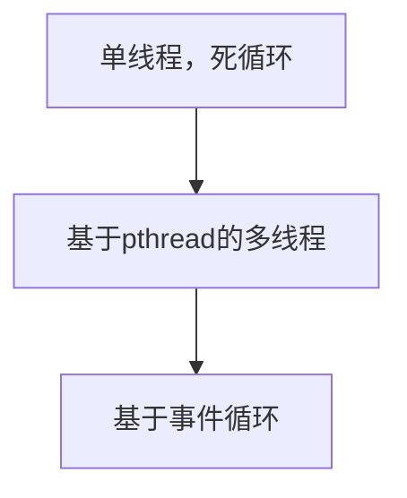

# TCP 服务端

`TCP`服务器端的实现是非常考验编码人员的功底的，可以很简单，也可以很复杂。

从简单到复杂的路线基本上可以概括为：

```mermaid
graph TD;
    A["单线程，死循环"] --> B[基于pthread的多线程];
    B --> C["基于事件循环"];
```

> [!tip|label: 提示]
> 在基于事件循环的版本之后有没有更高级的以本人目前的能力是无法研究到了，后续知道了再加上。