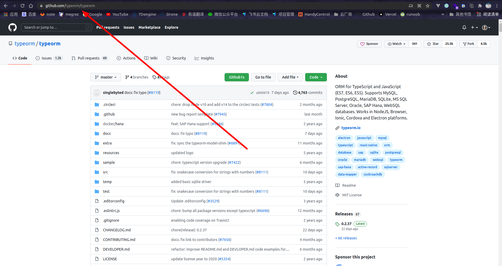
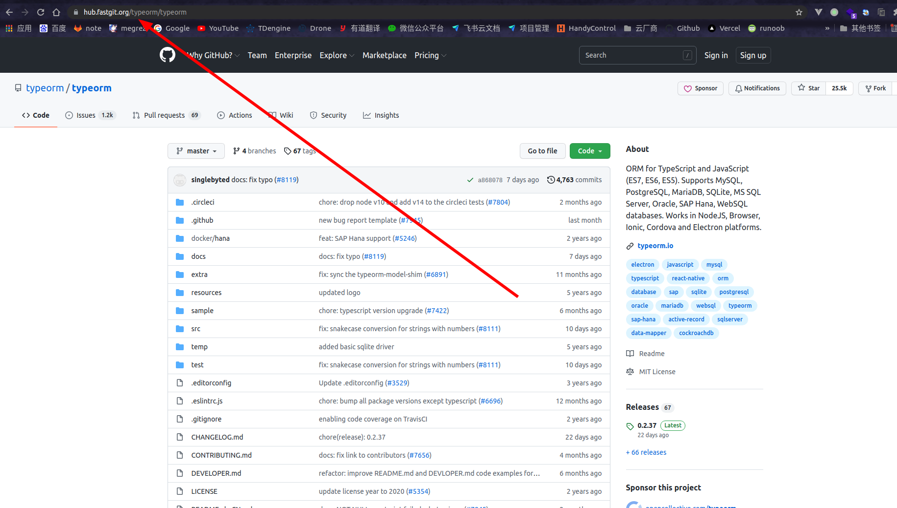

# GitHub复刻版

## 复刻版产生的原因

在国内，GitHub网址访问极其不稳定，从其中clone代码也会遇到有时候能下载，有时候不能下载的情况，所以就有人做了一个**复刻版**，用来在国内访问以及下载。

[复刻版地址](https://hub.fastgit.org/)

## 用法——网页版

一般我们在GitHub上查看开源项目时，可能会比较卡，以 `typeorm` 的GitHub仓库举例，如下所示：



有的时候就会刷新很慢，这个时候，将 `URL` 地址中的 `github.com` 替换成复刻版的域名 `hub.fastgit.org` 即可，如下所示：



## 用法——clone

在clone GitHub中项目的时候，很多情况下都会下载的比较慢（似乎和项目的流行程度有关），这个时候我们也是将clone地址中的 `github.com` 替换成复刻版的域名 `hub.fastgit.org` 即可，如下所示：

```bash
$ git clone https://github.com/typeorm/typeorm.git  # 原版地址

$ git clone https://hub.fastgit.org/typeorm/typeorm.git # 复刻版地址
```

> [!warning|label: 注意]
> 采用复刻版clone项目后，不能往上提交！！！
