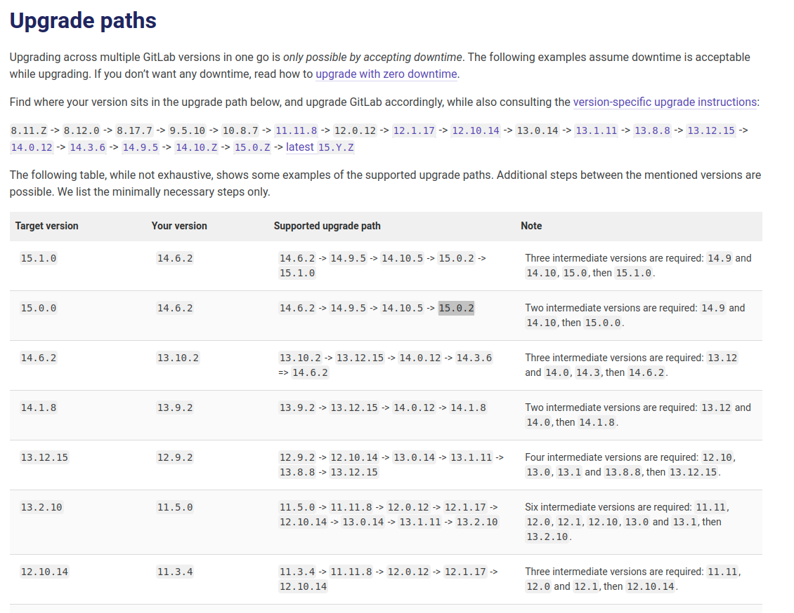

# 跨版本升级

## 场景

有的时候我们没有勤于升级，会导致 `Gitlab` 的升级出现断档，类似于 `Ubuntu` 的升级，比如目前我们使用的是 `Ubuntu18.04` ，最新版是 `Ubuntu22.04` ，是不能直接从 `18.04` 升级到 `22.04` 的，需要先升级到 `20.04` ，之后再升级到 `22.04` 。

> [!tip|label: 提示]
> `Ubuntu` 的升级还分为 `LTS` 版本和 `非LTS` 版本，如果是 `非LTS` 版本，那就更麻烦了，要一步一步的从 `非LTS` 版本升级，最终升级到 `LTS` 版本，很多次升级！！！

## 错误信息

```bash
Preparing to unpack .../gitlab-ce_15.1.2-ce.0_amd64.deb ...
gitlab preinstall: It seems you are upgrading from major version 14 to major version 15.
gitlab preinstall: It is required to upgrade to the latest 15.0.x version first before proceeding.
gitlab preinstall: Please follow the upgrade documentation at https://docs.gitlab.com/ee/update/index.html#upgrade-paths
dpkg: error processing archive /var/cache/apt/archives/gitlab-ce_15.1.2-ce.0_amd64.deb (--unpack):
 new gitlab-ce package pre-installation script subprocess returned error exit status 1
Errors were encountered while processing:
 /var/cache/apt/archives/gitlab-ce_15.1.2-ce.0_amd64.deb
E: Sub-process /usr/bin/dpkg returned an error code (1)
```

错误信息很明显，我们从 `14` 主版本升级的 `15` 主版本中间需要先升级到 `15.0.x` 版本才行。

## 解决方案

首先查看官方的升级路径：https://docs.gitlab.com/ee/update/index.html#upgrade-paths





可以看到从 `14.6.2` 版本到 `15.1.0` 版本需要经过 `15.0.2` 版本，因此，我们先升级到 `15.0.2` 版本，之后再升级到最新版本。

```bash
$ sudo apt install gitlab-ce=15.0.2-ce.0
```

> [!tip|label: 提示]
> 升级指定版本的语句： `$ sudo apt install gitlab-ce=<YOUR-LATEST-MINOR-VERSION>-ce.0`
