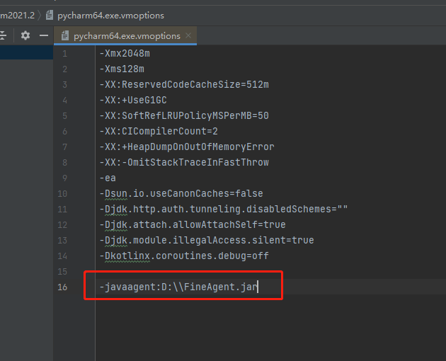
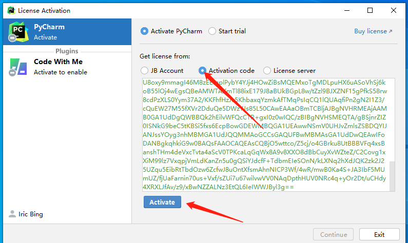
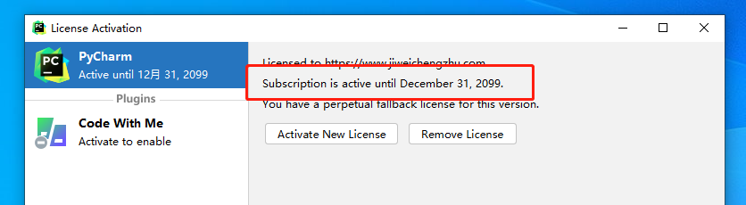

# 2021 全系破解

[破解补丁](https://megrez-file.virtualbing.cn/IDE/JetBrains/2021%E5%85%A8%E7%B3%BB%E7%A0%B4%E8%A7%A3/JetBrains2021%E6%9C%80%E6%96%B0%E5%85%A8%E5%AE%B6%E6%A1%B6%E6%BF%80%E6%B4%BB.zip)

> [!tip|label: 提示]
> 以 `PyCharm` 为例

## 评估使用

首先用 `JetBrains` 账号登录 `PyCharm` ，之后选择**评估**进入，然后新建一个工程。

> [!tip|label: 提示]
> 如果已经过了评估期，可以参考[这篇文章](https://www.exception.site/essay/idea-reset-eval)

## 配置代理

将破解补丁中的 `FineAgent.jar` 文件放到**D 盘根目录**下。

> [!tip|label: 提示]
> 不一定要放到**D 盘根目录**，但是放的路径中不能出现**中文**，更不能出现**空格**以及**特殊字符**，为了方便起见，**建议**放到**D 盘根目录**下。

之后点击菜单 `Help` 选择 `Edit Custom VM Options` ，输入如下内容：

```ini
-javaagent:D:\\FineAgent.jar
```

如下所示：



## 激活

重启 `PyCharm` ，从破解补丁中找到**激活码**，输入即可，如下所示：



点击 `Active` 按钮激活成功，如下所示：


