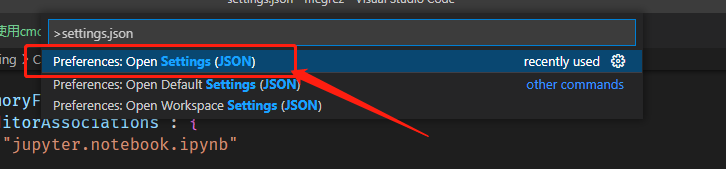
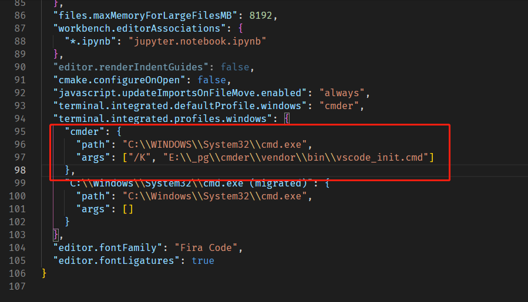
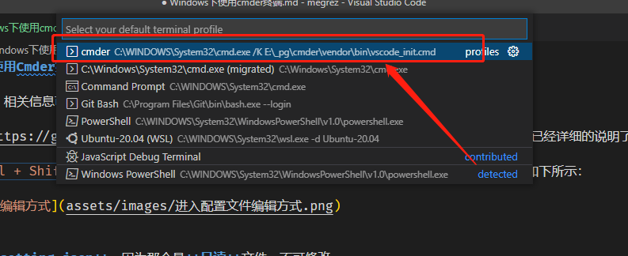

# Windows下使用Cmder终端

关于 `Cmder` 相关信息可以转至笔记：[Cmder](../../Windows/基础篇/终端/Cmder/README.md)

[官方wiki](https://github.com/cmderdev/cmder/wiki/Seamless-VS-Code-Integration)中已经详细的说明了配置方法，照做即可。

首先通过 `Ctrl + Shift + P` 快捷键打开搜索弹窗，输入 `settings.json` 关键字，打开配置页，如下所示：

> [!tip|label: 提示]
> 不要打开**默认setting.json**，因为那个是**只读**文件，不可修改。

之后修改 `terminal.integrated.profiles.windows` 字段，增加 `cmder` 配置 ，如下所示：

接下来将**默认终端**调整成 `cmder` 即可，如下所示：

