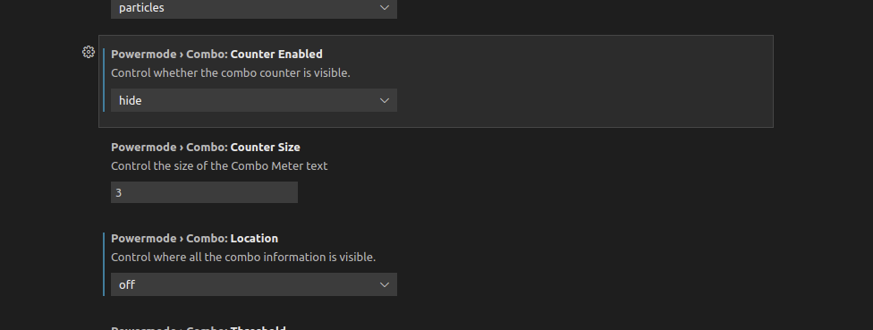

# 优秀插件

## 公共必备插件

* Code Spell Checker (拼写检查插件，检查单词拼写错误，这个必须装，必须装，必须装，毋庸置疑！！！)
* Todo Tree (查看项目中TODO标记)
* Bracket Pair Colorizer (括号高亮匹配插件)
* Better Comments (更漂亮的注释显示)
* Git History (Git相关插件)
* GitLens — Git supercharged (Git相关插件)
* DotENV (用于解析env文件，前后台都要装)
* Prettier - Code formatter (格式化代码插件）
* ESLint (代码风格插件)

## 前端必备插件

* Vetur (vue2项目必备)
* SCSS Formatter (scss语法插件)
* Vue Language Features (Volar) (vue3项目必备)

## `NestJS` 后台必备插件

* Docker (Docker支持)
* GraphQL (GraphQL支持)
* Prisma (Prisma支持)
* Apt Source List Syntax (Linux apt源格式插件)
* vscode-dbml (dbml格式文件支持插件)
* vscode-proto3 (proto文件支持插件)
* Clang-Format (C/C++格式化插件，也可用于proto文件) 

> [!warning|label: 注意]
> `Clang-Format` 插件需要电脑安装 `clang-format` 软件，并配置才行！ `Ubuntu 20.04` 安装方法： `$ sudo apt install clang-format` 。

## `C/C++` 项目必备插件

* C/C++ Extension Pack
  + C/C++
  + C/C++ Themes
  + CMake
  + CMake Tools
* Code Runner
* Clang-Format

## `Go` 语言项目必备插件

* Go (Go语言支持)

## `Rust` 语音项目必备插件

* Rust
* rust-analyzer （语法分析）
* rust syntax （语法高亮）
* crates
* better toml （TOML格式更好的展示）
* rust test lens

## `QuecPython` 项目必备插件

* Guides (更好用的缩进参考线)
* koroFileHeader (生成文件头部注释，需要配置，默认生成全文件的)
* Python Indent (更好用的缩进参考线)
* Python Docstring Generator (Python代码注释插件)

> [!tip|label: 提示]
> `Python` 项目需要对配置文件进行单独配置，具体请转至笔记：[移远工程配置-vscode](../../硬件/移远/工程配置/vscode工程配置.md)

## 合宙Lua项目必备插件

* vscode-lua-format (Lua代码格式化插件)
* Lua (Lua语言插件)
* LUAT (合宙Luat框架插件)

## `Java` 项目必备插件

* Java Extension Pack

`Java Extension Pack` 插件是一个**插件组**，包含的插件列表如下：

* Language Support for Java(TM) by Red Hat
* Debugger for Java
* Maven for Java
* Java Test Runner
* Project Manager for Java
* Visual Studio IntelliCode

## 可选插件

* Highlight Line (当前行高亮插件)
* vscode-icons (图标插件，美化项目图标)
* markdown-formatter (markdown语法插件)
* Markdown Preview Mermaid Support (mermaid语法支持插件)
* Markdown All in One (markdown智能提示插件)
* Power Mode (酷炫写代码插件-保守者勿用，这个安装好了之后需要手动启用，默认是不启用的)
* CodeSnap (生成代码片段截图)
* Excel Viewer (查看/编辑Excel和CSV文件)

> [!tip|label: Power Mode插件配置]
> 最近 `PowerMode` 插件更新了，会在右上角提示连续输入计数，这个有点影响编码了，分散注意力，将其关闭：
>  

