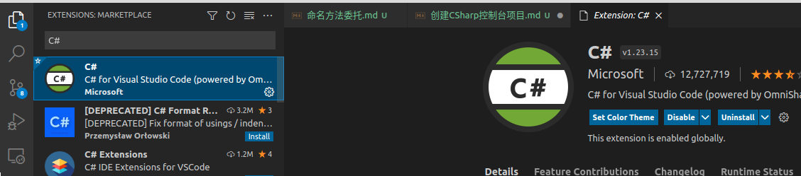

# 创建C#控制台项目

::: warning 大前提
**只支持**基于 `.Net Core` 的项目，而且还得是能够跨平台的，例如基于 `.Net Core` 的 `WinForm` 程序就**不行**。
:::

## 环境配置

首先安装 `.net Core` ，[下载地址](https://dotnet.microsoft.com/download)

`vscode` 扩展中安装 `C#扩展` ，如下所示：



## 创建项目

在想要创建项目的文件夹下（空文件夹哦），输入如下命令进行创建：

```shell
$ dotnet new console
```

::: tip 提示
可以通过 `dotnet new -l` 命令来查看**可选模板**
:::

之后通过 `vscode` 打开这个文件夹即可。

## 运行项目

通过 `vscode` 打开后， `vscode` 会询问你是否生成缺失的文件，点击 `yes` 后，就会生成 `.vscode/launch.json` 文件和 `.vscode/tasks.json` 文件，不用配置，我们直接点击 `F5` 快捷键就能运行了！

::: details launch.json文件内容

```json
{
    "version": "0.2.0",
    "configurations": [
        {
            // Use IntelliSense to find out which attributes exist for C# debugging
            // Use hover for the description of the existing attributes
            // For further information visit https://github.com/OmniSharp/omnisharp-vscode/blob/master/debugger-launchjson.md
            "name": ".NET Core Launch (console)",
            "type": "coreclr",
            "request": "launch",
            "preLaunchTask": "build",
            // If you have changed target frameworks, make sure to update the program path.
            "program": "${workspaceFolder}/bin/Debug/net5.0/csharp-test.dll",
            "args": [],
            "cwd": "${workspaceFolder}",
            // For more information about the 'console' field, see https://aka.ms/VSCode-CS-LaunchJson-Console
            "console": "internalConsole",
            "stopAtEntry": false
        },
        {
            "name": ".NET Core Attach",
            "type": "coreclr",
            "request": "attach"
        }
    ]
}
```

:::

::: details tasks.json文件内容

```json
{
    "version": "2.0.0",
    "tasks": [
        {
            "label": "build",
            "command": "dotnet",
            "type": "process",
            "args": [
                "build",
                "${workspaceFolder}/csharp-test.csproj",
                "/property:GenerateFullPaths=true",
                "/consoleloggerparameters:NoSummary"
            ],
            "problemMatcher": "$msCompile"
        },
        {
            "label": "publish",
            "command": "dotnet",
            "type": "process",
            "args": [
                "publish",
                "${workspaceFolder}/csharp-test.csproj",
                "/property:GenerateFullPaths=true",
                "/consoleloggerparameters:NoSummary"
            ],
            "problemMatcher": "$msCompile"
        },
        {
            "label": "watch",
            "command": "dotnet",
            "type": "process",
            "args": [
                "watch",
                "run",
                "${workspaceFolder}/csharp-test.csproj",
                "/property:GenerateFullPaths=true",
                "/consoleloggerparameters:NoSummary"
            ],
            "problemMatcher": "$msCompile"
        }
    ]
}
```

:::

当然，直接在控制台中输入： `$dotnet run` 命令也是能运行的
