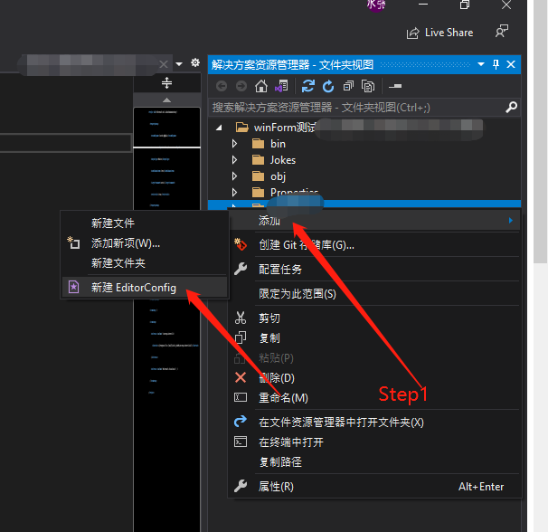
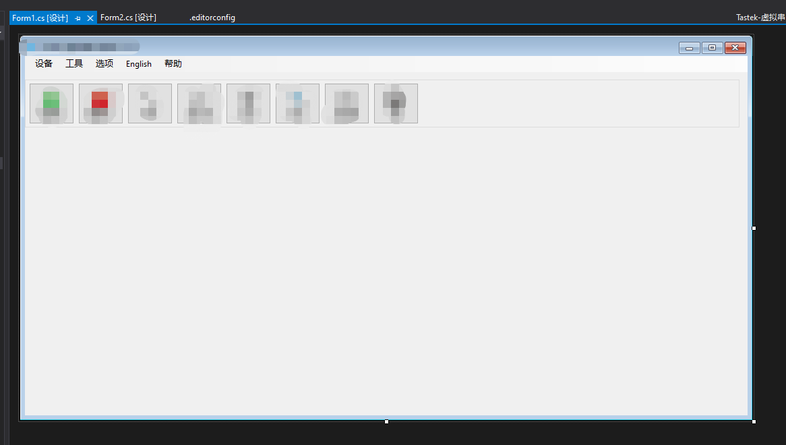

# 反编译winForm无法展示设计视图

## 场景

通过 `ILSpy` 反编译 `winForm` 软件得到如下项目工程：

通过 `vs` 打开此工程：

可以看到，本来 `Form1.cs` 文件应该展示 `winForm` **设计视图**的，但是现在直接展示了**C#源码**。

## 解决方法

点击**解决方案资源管理器**右上角的**在解决方案和可用视图之间切换**按钮，如下所示：

进入项目文件夹后，**右键**——>**添加**——>**新建EditorConfig**，如下所示：

接下**删除所有活动窗口**，**重新打开**就能显示页面了，如下所示：

::: tip 提示
如果发现切换不回解决方案资源管理器的话，就先退出，会提示是否保存`xxx.sln`文件，选择保存就行，之后再打开即可。（切换不回去就是因为没有`xxx.sln`文件，生成一个就好了，一般vs打开后**默认**都会生成一个，如果没有的话，退出的时候会提示）
:::