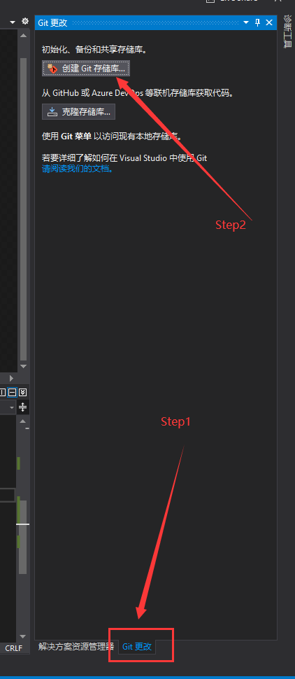
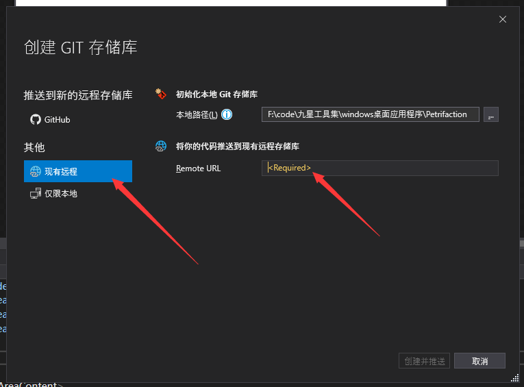

# 集成Git

## 需求

采用 `Git` 作为代码管理工具，直接采用 `vs` 创建工程项目后，如何将项目推送到云端。

::: tip 提示
云端是一个**空的GIT仓库**，没有任何提交信息！
:::

> [!warning|label:难点]
> 核心难点是如何编写 `.gitignore` 文件等 `git` 配置文件。

## 解决方式

`vs` 不愧被称之为宇宙第一编辑器，其强大真的让人叹为观止，点击右下角的 `Git更改` ，并选择 `创建Git仓库` ，如下所示：

在弹出的页面中添加远程仓库URL地址即可

接下来点击`创建并推送`按钮即可，远端Git仓库就能看到这个已经配置好了的项目代码了！！！

