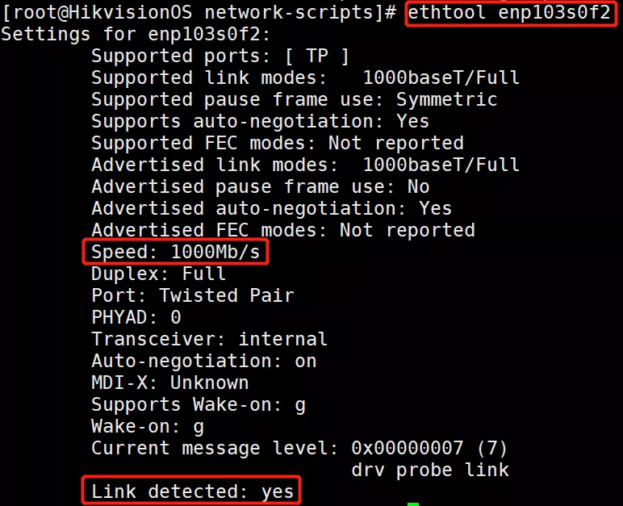

# 网络配置

## 查看网络配置

```bash
$ ip a
```

可以得到网卡名称和基本配置信息。详细的配置信息在 `/etc/sysconfig/network-scripts/` 文件夹下，根据网卡名称来查看。

## 网卡测试

一般服务器都会有多网卡，我们先测试一下那个网卡对应那个网口，**别插错了！！！**

输入如下代码

```bash
$ ethtool –p 网卡名称 30
```

对应的网卡灯会闪亮 `30` 秒，用此种方法来判断网线插在哪一个网口上。由于 `HIKOS` 系统默认网卡配置，网口插上网线对应的网卡灯不会亮，后续会通过修改网卡配置文件恢复网卡灯状态。

## 重启网络

命令：

```bash
$ systemctl restart network.service
```

## 测试

查看网卡状态命令：

```bash
$ ethtool 网卡名称
```

确认`Speed`这一列网卡速度是否正常，确认`Link detected`这一列状态是否为`yes`。正常情况示例：

