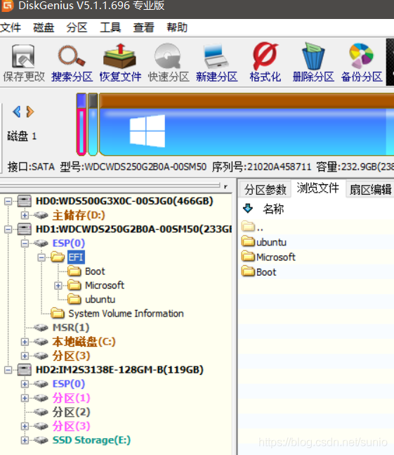
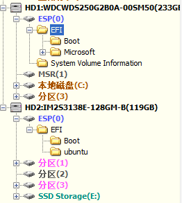

# 安装到移动硬盘

参考文章：https://blog.csdn.net/sunio/article/details/114898498

## 采坑

### 引导BUG

将系统安装到移动硬盘后，会发现其引导写到了主硬盘哪里，而不是移动硬盘上。导致只能在安装的电脑上运行，还修改了安装电脑的启动，安装电脑默认进 `ubuntu` 了，拔掉移动硬盘后显示 `gurb` 错误！

首先插上移动硬盘，开机进入 `Windows` 操作系统，下载安装[DiskGenius](https://www.diskgenius.cn/)

打开软件，会发现在 `Win10` 系统盘（ `HD1` ）和移动硬盘( `HD2` )上都有一个 `ESP` 分区。 `Win10` 系统盘的 `ESP` 分区中有一个名为 `EFI` 的文件夹而移动硬盘的 `ESP` 分区为**空**。

> [!tip|label: 提示]
> 再进行接下来的操作前先将 `Win10` 中的 `EFI` 文件夹复制到桌面上并**备份**，以防引导损坏进不了系统。

将 `Win10` 系统盘的 `ESP` 分区中的 `EFI` 文件夹复制到移动硬盘的 `ESP` 分区中。

> [!tip|label: 提示]
> 没有复制功能，直接在移动硬盘的 `ESP` 分区中新建 `EFI` 文件夹，之后导入 `Win10` 系统盘中 `ESP` 分区内的 `EFI` 文件夹的备份。

接下来删除 `Win10` 系统盘 `EFI` 文件夹中的 `Ubuntu` 文件夹和移动硬盘中 `EFI` 文件夹下的 `Microsoft` 文件夹。这样两个硬盘 `EFI` 启动设置就互不干扰了。

从移动硬盘启动的时候要注意选择 `EFI` 开头的，而不是 `SATA` 开头的硬盘名。
