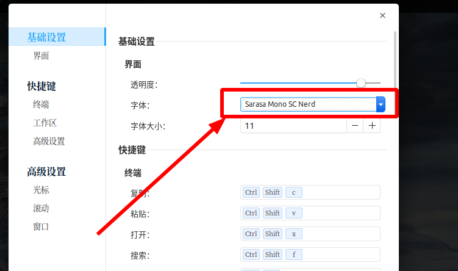
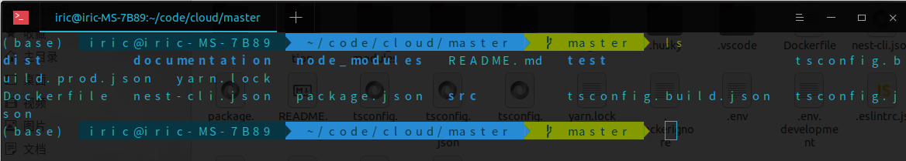

# Ubuntu 20.04 配置 zsh

使用 `zsh` 代替默认的 `bash` 能够很好的优化终端体验， `oh-my-zsh` 支持很多非常好用的功能，例如： `自动补全` , `历史命令记录` , `特殊软件命令` 等等

## 安装zsh

```shell
$ sudo apt install zsh
```

### 更改默认shell为zsh

```shell
$ chsh -s /bin/zsh
```

`注意：` 需要输入密码

## 安装oh-my-zsh

[Github 地址](https://github.com/ohmyzsh/ohmyzsh)

### 方法一：自动化脚本安装

> [!warning|label: 注意]
> 自动化脚本安装可能无法安装，因为软件的下载地址为（ `raw.githubusercontent.com` ），国内部分网络禁了这个域名。

* 通过 `curl` 安装

```shell
$ sh -c "$(curl -fsSL https://raw.githubusercontent.com/ohmyzsh/ohmyzsh/master/tools/install.sh)"
```

* 通过 `wget` 安装

```shell
$ sh -c "$(wget -O- https://raw.githubusercontent.com/ohmyzsh/ohmyzsh/master/tools/install.sh)"
```

* 通过 `fetch` 安装

```shell
$ sh -c "$(fetch -o - https://raw.githubusercontent.com/ohmyzsh/ohmyzsh/master/tools/install.sh)"
```

### 方法二： git手动安装

#### Step1. clone项目到本地

```shell
$ git clone https://github.com/ohmyzsh/ohmyzsh.git ~/.oh-my-zsh

# 使用GitHub复刻版
$ git clone https://hub.fastgit.org/ohmyzsh/ohmyzsh.git ~/.oh-my-zsh
```

#### Step2. 拷贝 `.zshrc` 配置文件

```shell
$ cp ~/.oh-my-zsh/templates/zshrc.zsh-template ~/.zshrc
```

#### Step3. 重启

```shell
$ sudo reboot
```

#### Step4. 下载 `zsh-syntax-highlighting` 插件

```shell
$ git clone https://github.com/zsh-users/zsh-syntax-highlighting.git ${ZSH_CUSTOM:-~/.oh-my-zsh/custom}/plugins/zsh-syntax-highlighting

# 使用GitHub复刻版
$ git clone https://hub.fastgit.org/zsh-users/zsh-syntax-highlighting.git ${ZSH_CUSTOM:-~/.oh-my-zsh/custom}/plugins/zsh-syntax-highlighting
```

#### Step5. 下载 `zsh-autosuggestions` 插件

```shell
$ git clone https://github.com/zsh-users/zsh-autosuggestions.git ${ZSH_CUSTOM:-~/.oh-my-zsh/custom}/plugins/zsh-autosuggestions

# 使用GitHub复刻版
$ git clone https://hub.fastgit.org/zsh-users/zsh-autosuggestions.git ${ZSH_CUSTOM:-~/.oh-my-zsh/custom}/plugins/zsh-autosuggestions
```

#### Step6. 更改配置文件

```shell
$ vim ~/.zshrc
```

使用 `af-magic` 主题

```bash
# Set name of the theme to load --- if set to "random", it will
# load a random theme each time oh-my-zsh is loaded, in which case,
# to know which specific one was loaded, run: echo $RANDOM_THEME
# See https://github.com/ohmyzsh/ohmyzsh/wiki/Themes
ZSH_THEME="af-magic"
```

增加插件

```bash
# Which plugins would you like to load?
# Standard plugins can be found in ~/.oh-my-zsh/plugins/*
# Custom plugins may be added to ~/.oh-my-zsh/custom/plugins/
# Example format: plugins=(rails git textmate ruby lighthouse)
# Add wisely, as too many plugins slow down shell startup.
plugins=(git zsh-syntax-highlighting zsh-autosuggestions)
```

#### Step7. 加载 `.zshrc` 文件

```shell
$ source ~/.zshrc
```

## 使用agnoster主题

### Step1. 修改zsh配置

```shell
# 修改这里切换主题
#ZSH_THEME="robbyrussell"
ZSH_THEME="agnoster"

# agnoster 主题设置：隐藏当前用户
#prompt_context() {
#  DEFAULT_USER="iric"
#}

# agnoster 主题设置：只显示当前用户名
prompt_context() {
  if [[ "$USER" != "$DEFAULT_USER" || -n "$SSH_CLIENT" ]]; then
    prompt_segment black default "%(!.%.)$USER"
  fi
}
```

之后加载配置：

```shell
$ source ~/.zshrc
```

::: tip 提示
使用这个主题后，应该将终端调整为**黑色**主题，否则会出现颜色显示问题，推荐**深度终端**使用 `freya` 主题。
:::

### Step2. 安装更纱黑体

因为 `agnoster` 主题使用到了一些特殊的字符，会导致乱码，因此我们需要安装**终端专用**字体——**更纱黑体**。

[Github地址](https://github.com/laishulu/Sarasa-Mono-SC-Nerd)

测试是否有乱码：

```shell
$ echo "\ue0b0 \u00b1 \ue0a0 \u27a6 \u2718 \u26a1 \u2699"
```

主要看第三个输出是否为乱码即可。

首先从 `GitHub` 中 `clone` 字体仓库，

```shell
$ git clone https://github.com/laishulu/Sarasa-Mono-SC-Nerd.git

# 采用复刻版
$ git clone https://hub.fastgit.org/laishulu/Sarasa-Mono-SC-Nerd.git

$ cd Sarasa-Mono-SC-Nerd
$ sudo mkdir -p /usr/share/fonts/Sarasa-Mono-SC-Nerd
$ sudo cp * /usr/share/fonts/Sarasa-Mono-SC-Nerd    #复制字体文件到Linux系统中的/usr/share/fonts/Sarasa-Mono-SC-Nerd文件夹中
$ sudo mkfontscale      # 生成字体的索引信息
$ sudo mkfontdir        # 生成字体的索引信息
$ sudo fc-cache -fv     # 更新字体缓存
```

**重启！**

接下来设置深度终端的字体为 `Sarasa Mono SC Nerd` ，如下所示：



::: tip 提示
系统默认终端的字体找不到这个。。。
:::

### 安装powerline字体（备用）

[Github地址](https://github.com/powerline/fonts)

`powerline` 字体与**更纱黑体**是互补关系，也是 `agnoster` 主题推荐的字体，但是不如更纱黑体好用，因为其效果为：



明显需要自己调整才能用。

```shell
$ sudo apt install fonts-powerline

#刷新字体缓存
$ sudo fc-cache -vf
```
