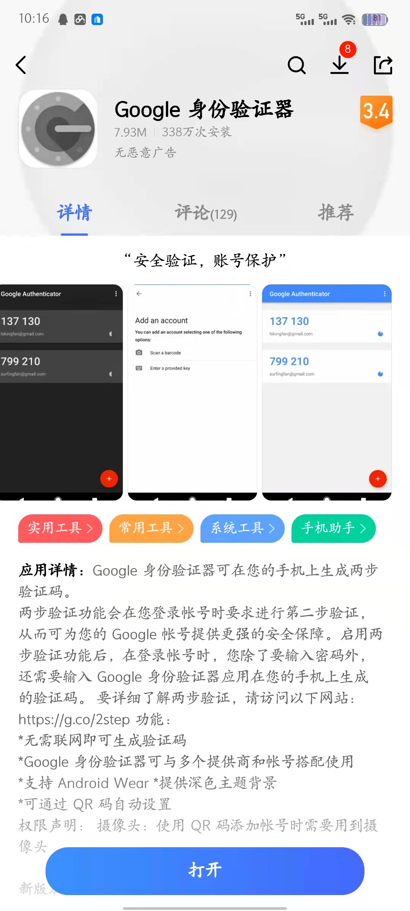
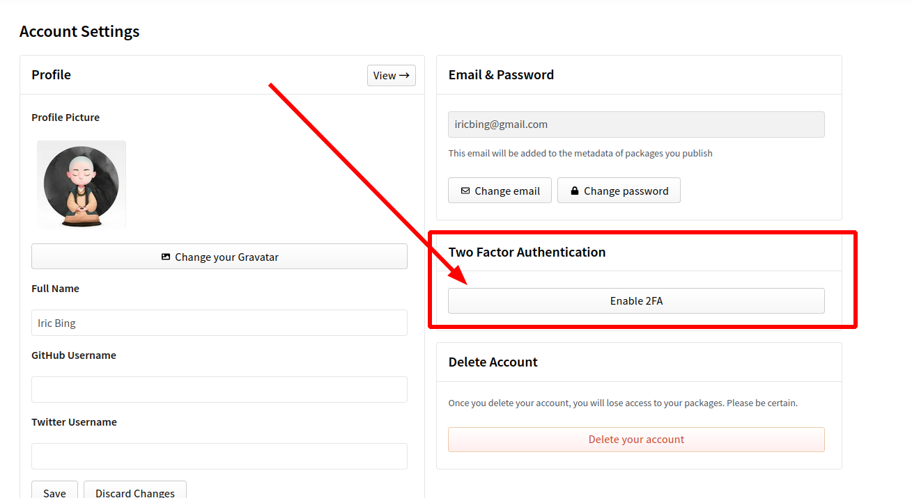
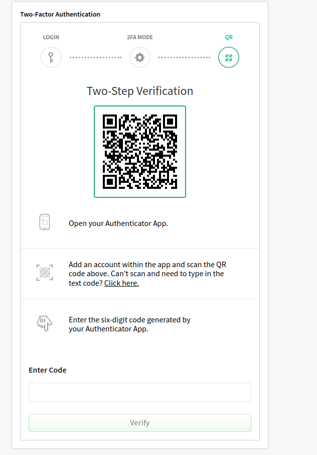
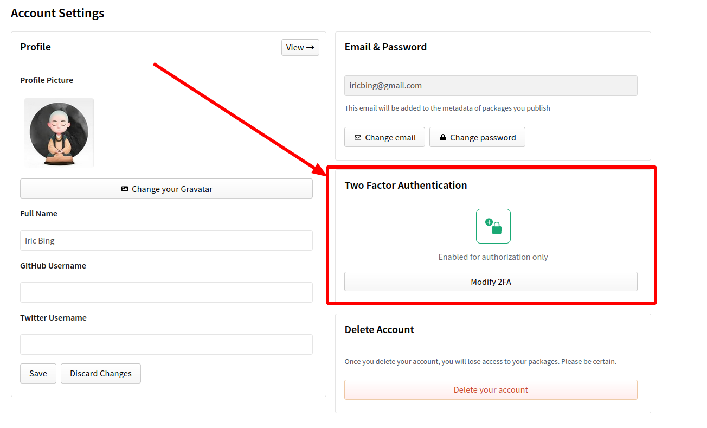
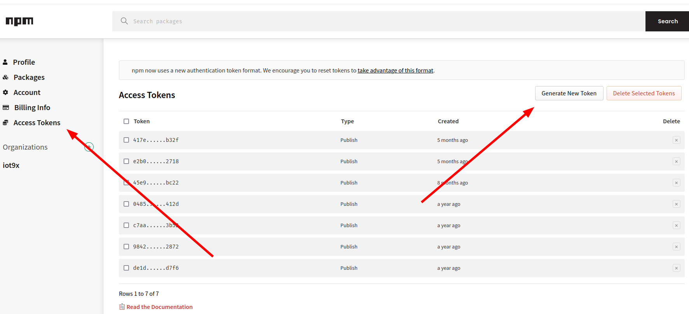
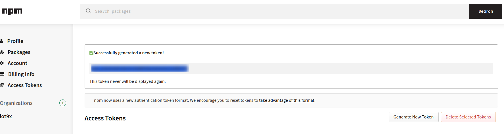
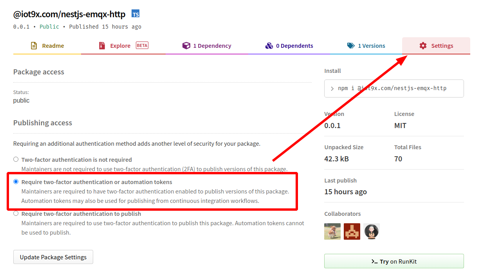

# 账号配置

## 前言

`NPM` 从**2021年12月**开始强制推 `2FA` 这种东西，登录和发包都需要做一定的处理。

## 开始前准备

手机下载**Google身份验证器**软件，我是 `vivo` 手机，在应用商店中直接搜索就能找到，软件信息如下：

> [!tip|label: 提示]
> 这个软件依赖 `Google` 框架，会询问你是否下载 `Google` 框架，同意，之后会自动下载并安装 `Google Play` 应用商店。

## NPM网站设置

### 开启2FA

在没有开启 `2FA` 的时候，通过用户名和密码来登录即可。接下来点击右上角的**个人头像**，选择 `Account` 菜单，可以看到 `Two Factor Authentication` 功能，如下所示：

默认是未开启的，我们需要开启一下，点击 `Enable 2FA` 按钮，开启 `2FA` 功能，之后选择 `Authorization` ，然后点击 `Submit` 按钮，如下所示：

接下来就进入到了扫码页面，如下所示：

拿出手机，用**Google身份验证器**软件扫码，就能拿到 `OTP` 码了。填入网页，点击 `Verify` 按钮，开启完成，然后记录 `recovery code` 即可。

开启完成，跳转回 `Account` 设置页面，可以看到 `Two Factor Authentication` 配置如下：

### 生成Automation Token

点击 `Access Tokens` 菜单，之后点击 `Generate New Token` 按钮，如下所示：

接下来选择 `Automation` 类型的 `AccessToken` ，之后点击 `Generate Token` 按钮，就生成成功了：

> [!warning|label: 注意]
> 一定要保存哦！

### 软件包设置

软件包第一次发布一定要在本地用 `npm login` 来**登录**到 `npm` 网站上，之后通过 `$ npm publish` 来发布，后续就可以通过自动化流程来发布了。

是用自动化流程来发布需要设置软件包的配置信息，进入软件包地址，点击**设置**，按如下所示选择即可：

