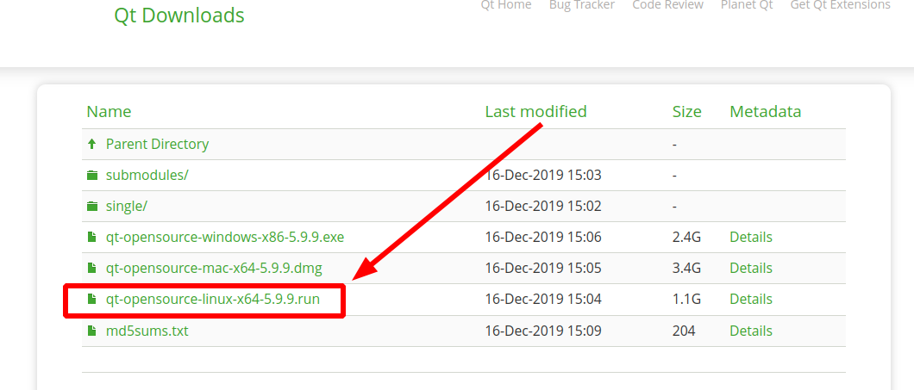

# Ubuntu 20.04 安装

## 安装依赖环境

```bash
$ sudo apt install gcc g++ cmake make libgl1-mesa-dev libglu1-mesa-dev
```

## 下载离线安装文件

[官方下载地址](https://download.qt.io/archive/qt/)

下载 `.run` 文件，如下所示：



## 安装

```bash
$ chmod 755 qt-opensource-linux-x64-5.9.9.run
$ ./qt-opensource-linux-x64-5.9.9.run
```

> [!warning|label:注意]
> 勾选需要的组件部分。

安装完成后就能在应用程序中看到 `Qt Creator` 了。
