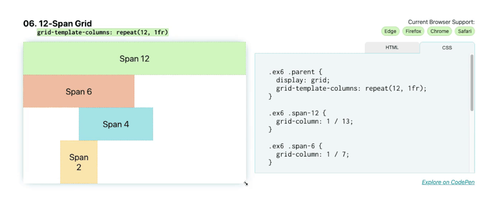
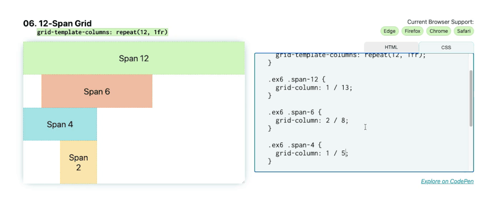

# 12 跨网格



可以使用 `repeat()` 函数在 `CSS` 中快速编写网格。对网格模板列使用 `repeat(12, 1fr)`; 将为每个 `1fr` 提供 `12` 列。

```css
.parent {
  display: grid;
  grid-template-columns: repeat(12, 1fr);
}

.child-span-12 {
  grid-column: 1 / 13;
}
```

现在有一个 `12` 列的轨道网格，我们可以将子项放在网格上。一种方法是使用网格线放置它们。例如， `grid-column: 1 / 13` 将跨越从第一到最后一行（第 `13` 行）并跨越 `12` 列。`grid-column: 1 / 5`; 将跨越前四个列。



另一种方法是使用 `span` 关键字。使用 `span` ，您可以设置起始线，然后设置从该起点跨越的列数。在这种情况下，`grid-column: 1 / span 12` 将等效于 `grid-column: 1 / 13` ，而 `grid-column: 2 / span 6` 将等效于 `grid-column: 2 / 8` 。

```css
.child-span-12 {
  grid-column: 1 / span 12;
}
```
