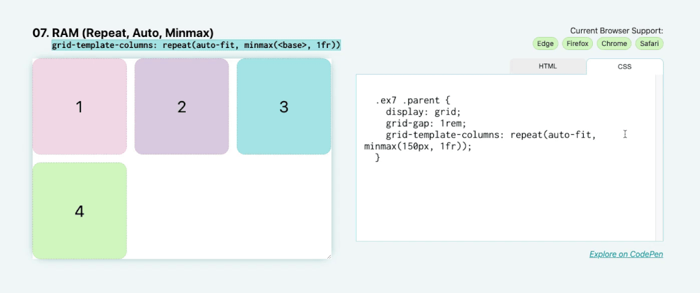

# RAM


对于此布局，结合已经了解的一些概念来创建具有自动放置且灵活的子项的响应式布局。漂亮整齐。这里要记住的关键点是 `repeat` 、 `auto-(fit|fill)` 和 `minmax()` ，可以记住它们的首字母缩写词 `RAM` 。

总之，应是这样：

```css
.parent {
    display: grid;
    grid-template-columns: repeat(auto-fit, minmax(150px, 1fr));
}
```

再次使用 `repeat` ，但这次使用 `auto-fit` 关键字而不是显式数值。这可以自动放置这些子元素。这些子元素的基本最小值为 `150px` ，最大值为 `1fr` ，这意味着在较小的屏幕上，它们将占据整个 `1fr` 宽度，当它们达到 `150px` 宽度时，它们将开始流到同一条线上。

使用 `auto-fit` ，当它们的水平尺寸超过 `150px` 时，框将拉伸以填充整个剩余空间。但是，如果您将其更改为 `auto-fill` ，则当超出 `minmax` 函数中的基本大小时，它们将不会拉伸：




```css
.parent {
    display: grid;
    grid-template-columns: repeat(auto-fill, minmax(150px, 1fr));
}
```
