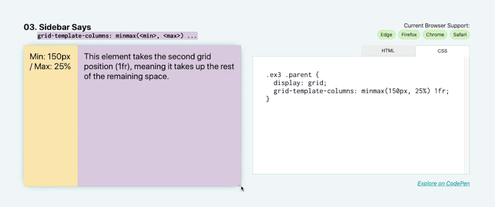

# 侧边栏布局





此演示对网格布局利用了 `minmax` 函数。我们在这里做的是将最小侧边栏大小设置为 `150px` ，但在更大的屏幕上，让它伸展出 `25%` 。侧边栏将始终占据其父级水平空间的 `25%` ，直到 `25%` 变得小于 `150px` 。

将以下值添加为 `grid-template-columns` 的值： `minmax(150px, 25%) 1fr` 。在第一列（在这种情况下，侧边栏）的项目其 `minmax` 为 `150px` （在 `25%` ），第二列项目（这里指 `main` 部分）占据其余的空间作为单一的 `1fr` 轨道。

```css
.parent {
    display: grid;
    grid-template-columns: minmax(150px, 25%) 1fr;
}
```
