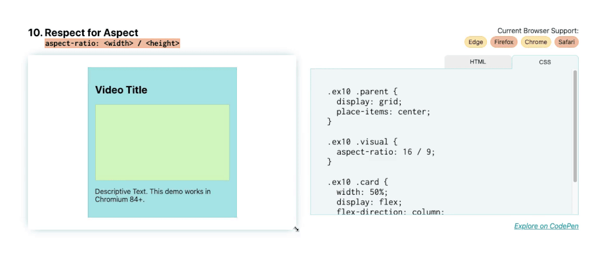

# 保持宽高比





此布局是最具实验性的布局。它最近在 `Chromium 84` 中被引入 `Chrome Canary` ， `Firefox` 正在积极努力实现这一点，但目前还没有任何稳定的浏览器版本。

不过，我确实想提及这一点，因为这是一个经常遇到的问题。这只是简单地保持图像的宽高比。

使用 `aspect-ratio` 属性，当我调整卡片大小时，绿色视觉块保持 `16 x 9` 的宽高比。我们通过 `aspect-ratio: 16 / 9` 保持此宽高比。

```css
.video {
    aspect-ratio: 16 / 9;
}
```

要在没有此属性的情况下保持 `16 x 9` 的宽高比，需要使用 `padding-top hack` 并为其提供 `56.25%` 的 `padding` 以设置顶宽比。我们很快就会有一个属性来避免黑客攻击和计算百分比的需要。可以使用 `1 / 1` 的比例制作正方形，使用 `2 / 1` 制作 `2:1` 比例。可以设置任何图像缩放比例。

```css
.square {
    aspect-ratio: 1 / 1;
}
```

虽然此功能仍在不断完善中，但它值得了解，因为它解决了许多开发人员面临的冲突，我自己也多次面临，尤其是在视频和 `iframe` 方面。
