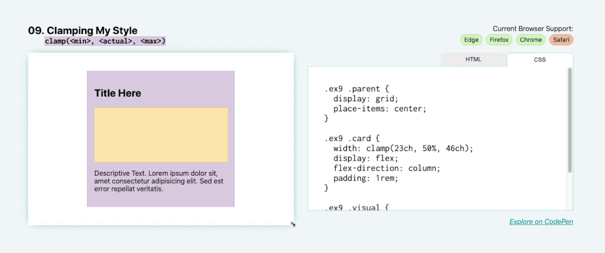

# 保持我的风格





此技术只有少数浏览器支持，但这些技术对布局和响应式 `UI` 设计有非常令人兴奋的影响。在本演示中，将使用固定工具设置宽度，如下所示： `width: clamp(<min>, <actual>, <max>)` 。

这将设置绝对最小和最大尺寸以及实际尺寸。有了值，应该这样：

```css
.parent {
    width: clamp(23ch, 60%, 46ch);
}
```

这里的最小尺寸是 `23ch` 或 `23` 个字符单元，最大尺寸是 `46ch` ， `46` 个字符。字符宽度单位基于元素的字体大小（特别是 `0` 字形的宽度）。“实际”尺寸为 `50%` ，代表此元素父宽度的 `50%` 。

在这里， `clamp()` 函数所做的是使该元素保持 `50%` 的宽度，直到 `50%` 大于 `46ch` （在较宽的视口上）或小于 `23ch` （在较小的视口上）。您可以看到，当我拉伸和收缩父尺寸时，这张卡片的宽度会增加到其最大限制点并减小到其限制最小点。然后它保持在父级的中心，因为我们已经应用了其他的属性来将它居中。这可以实现更清晰的布局，因为文本不会太宽（超过 `46ch` ）或太窄（小于 `23ch` ）。

这也是实现响应式排版的好方法。例如，您可以编写： `font-size: clamp(1.5rem, 20vw, 3rem)` 。在这种情况下，标题的字体大小将始终保持在 `1.5rem` 和 `3rem` 之间，但会根据 `20vw` 实际值增大和缩小以适应视口的宽度。

这是一种很好的技术，可以通过最小和最大尺寸值确保易读性。

> [!warning|label: 注意]
> 并非所有现代浏览器都支持它，因此请确保有回退措施并进行测试。
