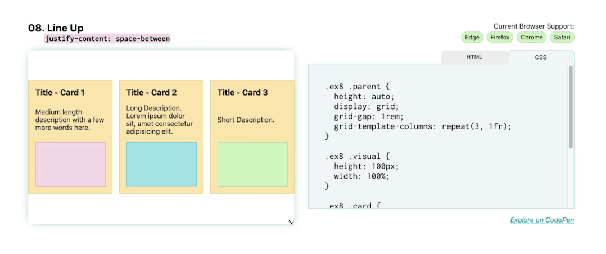

# 排列布局





对于下此布局，这里要主要说明的是 `justify-content: space-between` ，它将第一个和最后一个子元素放置在其边界框的边缘，其余空间均匀分布在元素之间。对于这些卡片，它们被放置在 `Flexbox` 显示模式中，使用 `flex-direction: column` 将方向设置为 `column` 。

这会将标题、描述和图像块放在父卡片内的垂直列中。然后，应用 `justify-content: space-between` 将第一个（标题）和最后一个（图像块）元素锚定到 `flexbox` 的边缘，并且它们之间的描述性文本以相等的间距放置到每个端点。

```css
.parent {
    display: flex;
    flex-direction: column;
    justify-content: space-between;
}
```
