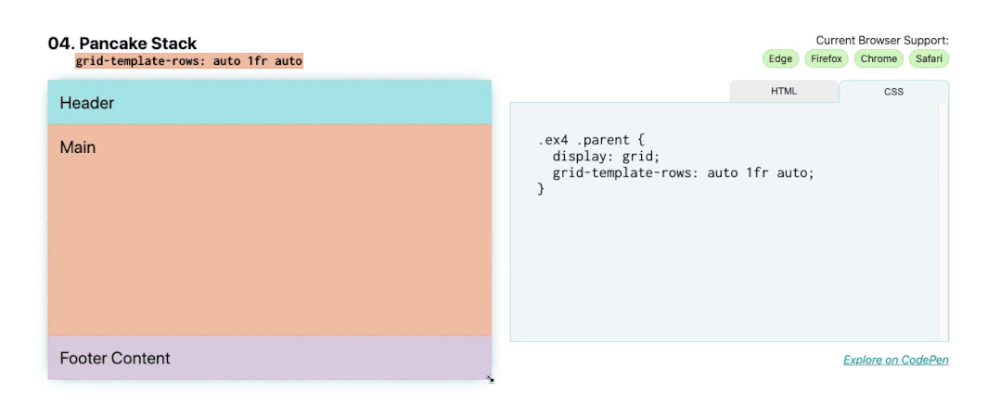

# 煎饼堆栈布局





与[解构煎饼式布局](../解构煎饼式布局/README.md)不同，当屏幕尺寸改变时，本例不会包含它的子元素。通常称为**粘性页脚**，这种布局通常用于网站和应用程序，跨多个移动应用程序（页脚通常是工具栏）和网站（单页应用程序通常使用这种全局布局）。

向组件添加 `display: grid` 将提供一个单列网格，但是主区域的高度将仅与页脚下方的内容一样高。

要使页脚粘在底部，请添加：

```css
.parent {
    display: grid;
    grid-template-rows: auto 1fr auto;
}
```

`1fr` 页眉和页脚内容设置为自动采用其**子项**的大小，并将剩余空间 ( `1fr` ) 应用于主区域，而 `auto` 调整大小的行将采用其子项的**最小内容**的大小，以便该内容大小增加，行本身将增长以进行调整。
