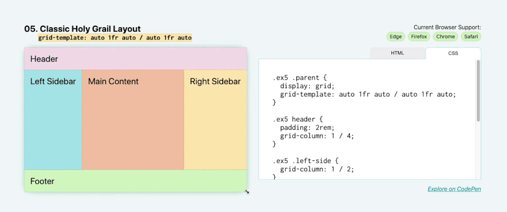

# 经典圣杯布局





对于经典的圣杯布局，有**页眉**、**页脚**、**左侧边栏**、**右侧边栏**和**主要内容**。类似于以前的布局，但现在**有侧边栏**！

要使用一行代码编写整个网格，请使用 `grid-template` 属性。这可以同时设置**行**和**列**。

属性和值对为： `grid-template: auto 1fr auto / auto 1fr auto` 。第一个和第二个以**空格**分隔的列表之间的**斜线**是**行**和**列**之间的**分隔符**。

```css
.parent {
    display: grid;
    grid-template: auto 1fr auto / auto 1fr auto;
}
```

与[煎饼堆栈布局](../煎饼堆栈布局/README.md) 一样，页眉和页脚具有**自动调整大小**的内容，这里的左侧和右侧边栏会根据其子项的固有大小自动调整大小。但是，这次是水平尺寸（宽度）而不是垂直尺寸（高度）。
