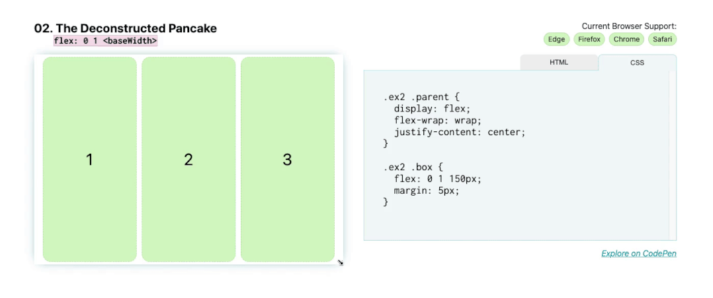
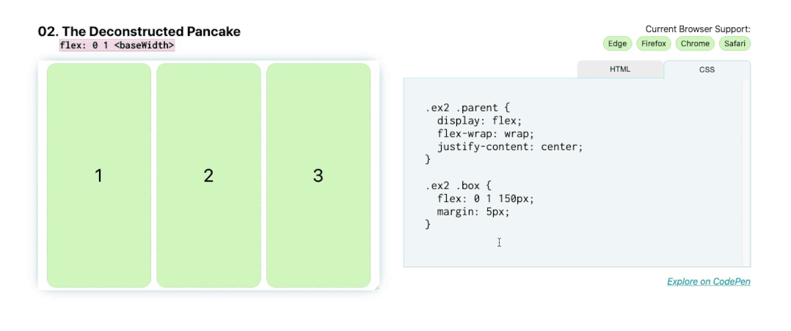

# 解构煎饼式布局





这是营销网站的常见布局，例如，可能有一行 `3` 个项目，通常带有图像、标题，然后是一些描述产品某些功能的文本。在移动设备上，我们希望它们能够很好地堆叠，并随着我们增加屏幕尺寸而扩展。

通过使用 `Flexbox` 实现此效果，不需要在屏幕尺寸发生变化时通过媒体查询来调整这些元素的位置。

`flex` 简写代表： `flex: <flex-grow> <flex-shrink> <flex-basis>` 。

正因为如此，如果想让框填充到它们的 `<flex-basis>` 大小，缩小到更小的尺寸，但不拉伸以填充任何额外的空间，请写入： `flex: 0 1 <flex-basis>` 。在这种情况下， `<flex-basis>` 是 `150px` ，所以应该是这样：

```css
.parent {
    display: flex;
}

.child {
    flex: 0 1 150px;
}
```

如果确实希望框在换到下一行时拉伸并填充空间，请将 `<flex-grow>` 设置为 `1` ，所以应该是这样：

```css
.parent {
    display: flex;
}

.child {
    flex: 1 1 150px;
}
```



现在，当增加或减少屏幕尺寸时，这些 `flex` 项目会缩小和增长。
