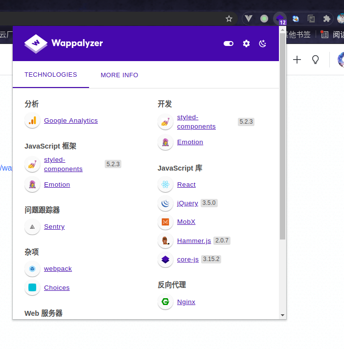
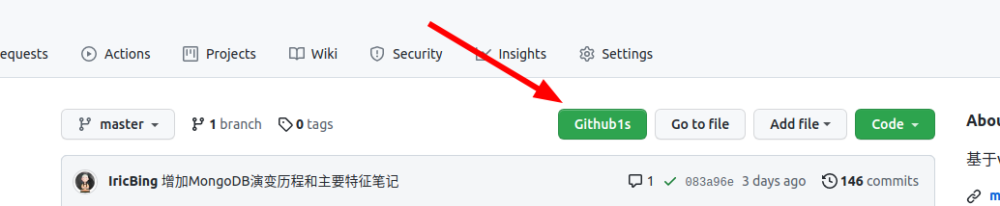
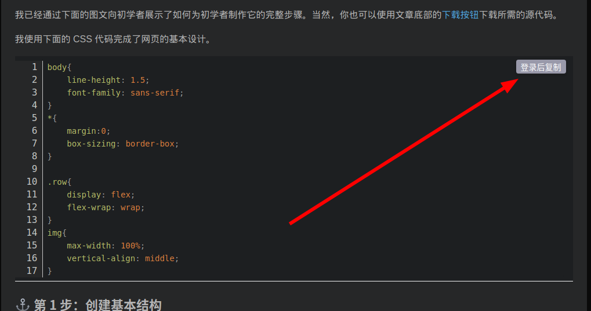
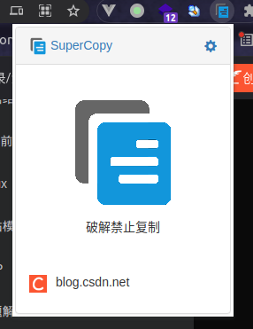
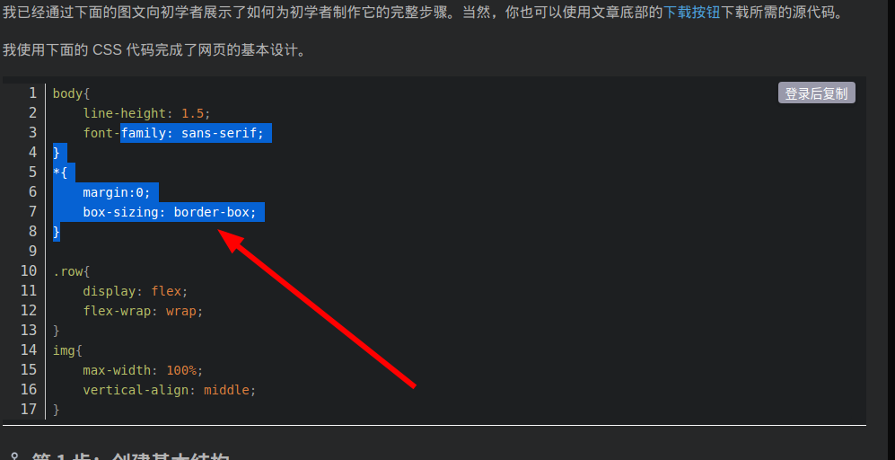

# 优秀扩展

## Wappalyzer

[Chrome应用商店地址](https://chrome.google.com/webstore/detail/wappalyzer/gppongmhjkpfnbhagpmjfkannfbllamg)

**功能**：查看网站所用的技术栈

## Github 1s

[Github地址](https://github.com/conwnet/github1s)

[Chrome应用商店地址](https://chrome.google.com/webstore/detail/github1s/lodjfmkfbfkpdhnhkcdcoonghhghbkhe)

**功能**：在GitHub网站查看仓库的时候添加 `GitHub1s` 按钮，点击可以在web版vscode中打开

## SuperCopy 超级复制

[Chrome应用商店地址](https://chrome.google.com/webstore/detail/supercopy-enable-copy/onepmapfbjohnegdmfhndpefjkppbjkm)

**功能**：取消某些恶心网站的复制限制，例如CSDN，必须要登录后才能复制，此插件就能直接破解限制。

我们随便打开一篇[CSDN文章](https://blog.csdn.net/qq_44273429/article/details/120085442?utm_medium=distribute.pc_feed_v2.none-task-blog-hot_rank_bottoming-3.pc_personrecdepth_1-utm_source=distribute.pc_feed_v2.none-task-blog-hot_rank_bottoming-3.pc_personrec)，可以看到代码是不能复制的，如下所示：

这个时候点击扩展的SuperCopy插件，就能解除限制了，如下所示：

破解完成后效果如下：

