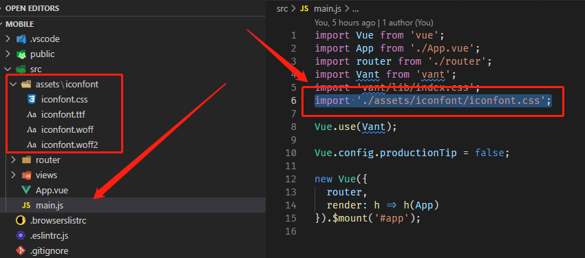

# 扩展icon

`VantUI` 默认提供的 `icon` 在真正项目中大概率上是不够用的，所以我们要扩展可用的 `icon` 。

## 阿里巴巴矢量图库

为了快速开发（省事），直接利用[阿里巴巴矢量图库](../../../../实践积累/阿里巴巴矢量图库/README.md)来找我们所需要的 `icon` 。

创建项目，将图标加入到项目，之后项目要配置 `FontClass/Symbol` 前缀和 `Font Family` ，如下所示：

> [!warning|label: 注意]
> 我们这里将 `FontClass/Symbol` 前缀设置成了 `van-icon-` ， `Font Family` 设置成了 `van-icon` 是有寓意的。这个是VantUI默认的配置，网上有很多文章这里都是配置的其他名称，然后引用的时候加一个 `class-prefix` ，这样确实也行，但是遇到 `icon` 引用的就不行了，比如：[Grid 宫格](https://vant-contrib.gitee.io/vant/#/zh-CN/grid)中就无法直接使用自定义图标，使用上述配置可以保证这里也能支持，问题就是**可能和原有图标名称冲突**。

## 项目引入

接下来将项目下载到本地，下载下来的是一个 `download.zip` 的压缩包，解压后将里面的 `iconfont.css` 、 `iconfont.tff` 、 `iconfont.woff` 、 `iconfont.woff2` 复制到项目的 `/src/assets/iconfont` 文件夹下，并在 `main.js` 文件中引入，如下所示：

接下来就正常使用即可。
