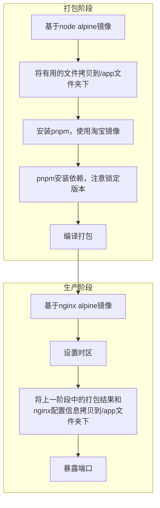

# 构建Docker镜像

## 工程环境

* Vue 3.x
* Vite
* pnpm

## 思想



## 完整示例文件

```dockerfile
# Stage 1
FROM node:16.14.2-alpine as builder

WORKDIR /app

COPY .npmrc .
COPY package.json .
COPY pnpm-lock.yaml .
COPY tsconfig.json .
COPY tsconfig.node.json .
COPY vite.config.ts .
COPY .eslintignore .
COPY .eslintrc.js .
COPY .prettierrc.js .
COPY .browserslistrc .

COPY .env.production .
COPY public public
COPY src src
COPY index.html .
COPY nginx.conf .

RUN npm i pnpm -g --registry=http://registry.npmmirror.com
RUN pnpm i --frozen-lockfile --ignore-scripts
RUN pnpm build

# Stage 2
FROM nginx:1.20.2-alpine as prod

LABEL maintainer="drone<drone@9xing.cn>"

WORKDIR /app

# 设置时区
RUN echo "Asia/Shanghai" > /etc/timezone && ln -sf /usr/share/zoneinfo/Asia/Shanghai /etc/localtime 

COPY --from=builder /app/dist ./dist
COPY --from=builder /app/nginx.conf /etc/nginx/conf.d/default.conf

EXPOSE 80
```

> [!note|label: 资料下载]
> - <a href="/Web/Vue3/容器镜像篇/构建Docker镜像/assets/files/nginx.conf" download="nginx.conf">nginx.conf</a>
