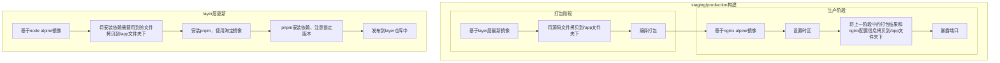

# 构建Docker镜像——Drone环境

## 工程环境

* Vue 3.x
* Vite
* pnpm
* Drone（Docker in Docker）

## 思想



## 完整示例文件

> [!note|label: 资源下载]
> - <a href="/Web/Vue3/容器镜像篇/构建Docker镜像Drone/assets/files/nginx.conf" download="nginx.conf">nginx.conf</a>
> - <a href="/Web/Vue3/容器镜像篇/构建Docker镜像Drone/assets/files/.drone.yml" download=".drone.yml">.drone.yml</a>
> - <a href="/Web/Vue3/容器镜像篇/构建Docker镜像Drone/assets/files/Dockerfile" download="Dockerfile">Dockerfile</a>
> - <a href="/Web/Vue3/容器镜像篇/构建Docker镜像Drone/assets/files/Dockerfile.layer" download="Dockerfile.layer">Dockerfile.layer</a>
> - <a href="/Web/Vue3/容器镜像篇/构建Docker镜像Drone/assets/files/Dockerfile.staging" download="Dockerfile.staging">Dockerfile.staging</a>

<details>
<summary>.drone.yml</summary>

```yaml
---
kind: pipeline
type: docker
name: staging deploy

steps:
  - name: auto tag
    image: alpine:3.15.0
    commands:
      - echo VITE_VERSION=staging >> .env.staging
      - echo VITE_VERSION_TIME=`date '+%Y-%m-%d %H:%M:%S'` >> .env.staging

  - name: build
    image: docker:dind
    volumes:
      - name: dockersock
        path: /var/run/docker.sock
    commands:
      - docker build -f Dockerfile.staging --no-cache -t xxx:staging .
      - docker tag xxx:staging registry.cn-hangzhou.aliyuncs.com/xxx/xxx:staging
      - docker push registry.cn-hangzhou.aliyuncs.com/xxx/xxx:staging

volumes:
  - name: dockersock
    host:
      path: /var/run/docker.sock

trigger:
  event:
    - push
  branch:
    - master
---
kind: pipeline
type: docker
name: production deploy

steps:
  - name: build
    image: docker:dind
    volumes:
      - name: dockersock
        path: /var/run/docker.sock
    commands:
      - docker build --no-cache -t xxx:`echo ${DRONE_TAG##v}` .
      - docker tag xxx:`echo ${DRONE_TAG##v}` registry.cn-hangzhou.aliyuncs.com/xxx/xxx:`echo ${DRONE_TAG##v}`
      - docker push registry.cn-hangzhou.aliyuncs.com/xxx/xxx:`echo ${DRONE_TAG##v}`
      - docker tag registry.cn-hangzhou.aliyuncs.com/xxx/xxx:`echo ${DRONE_TAG##v}` registry.cn-hangzhou.aliyuncs.com/xxx/xxx:latest
      - docker push registry.cn-hangzhou.aliyuncs.com/xxx/xxx:latest

volumes:
  - name: dockersock
    host:
      path: /var/run/docker.sock

trigger:
  event:
    - tag
---
kind: pipeline
type: docker
name: layer build

steps:
  - name: build
    image: docker:dind
    volumes:
      - name: dockersock
        path: /var/run/docker.sock
    commands:
      - docker build -f Dockerfile.layer --no-cache -t xxx:latest .
      - docker tag xxx:latest registry.cn-hangzhou.aliyuncs.com/xxx-layer/xxx:latest
      - docker push registry.cn-hangzhou.aliyuncs.com/xxx-layer/xxx:latest

volumes:
  - name: dockersock
    host:
      path: /var/run/docker.sock

trigger:
  event:
    - push
  branch:
    - layer
```

</details>

<details>
<summary>Dockerfile.staging</summary>

```dockerfile
# Stage 1
FROM registry.cn-hangzhou.aliyuncs.com/xxx/xxx:latest as builder

WORKDIR /app

COPY .env.staging .
COPY public public
COPY src src
COPY index.html .
COPY nginx.conf .

RUN pnpm build:staging

# Stage 2
FROM nginx:1.20.2-alpine as prod

LABEL maintainer="Iric<iricbing@gmail.com>"

WORKDIR /app

# 设置时区
RUN echo "Asia/Shanghai" > /etc/timezone && ln -sf /usr/share/zoneinfo/Asia/Shanghai /etc/localtime 

COPY --from=builder /app/dist ./dist
COPY --from=builder /app/nginx.conf /etc/nginx/conf.d/default.conf

EXPOSE 80
```

</details>

<details>
<summary>Dockerfile.layer</summary>

```dockerfile
# Stage 1
FROM node:16.14.2-alpine

WORKDIR /app

COPY .npmrc .
COPY package.json .
COPY pnpm-lock.yaml .
COPY tsconfig.json .
COPY tsconfig.node.json .
COPY vite.config.ts .
COPY .eslintignore .
COPY .eslintrc.js .
COPY .prettierrc.js .
COPY .browserslistrc .

RUN npm i pnpm -g --registry=http://registry.npmmirror.com
RUN pnpm i --frozen-lockfile --ignore-scripts
```

</details>
