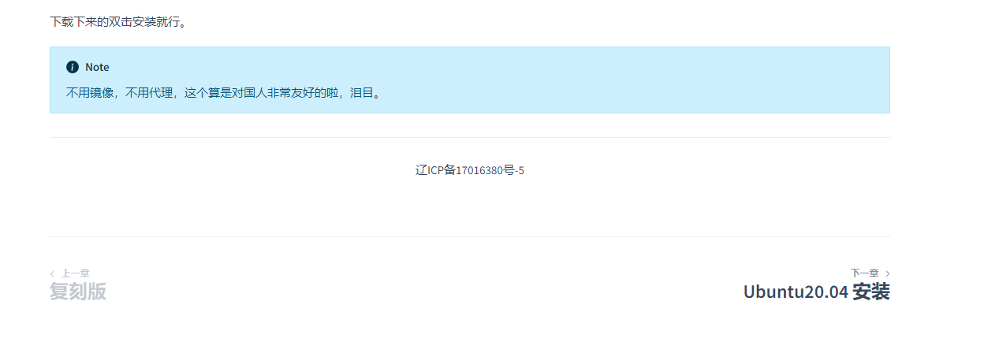

# 备案

> [!note]
> 在中国境内的网站全部需要备案，不备案的话，你懂得。

## 使用docsify-beian

[npm地址](https://www.npmjs.com/package/docsify-beian)

[GitHub地址](https://github.com/HerbertHe/docsify-beian)

> [!tip|label: 细节点]
> 在 `index.html` 中对于 `docsify-beian` 的引用要在其他可能影响底部插件的前面，否则会导致其先执行，效果不好，如下所示：

