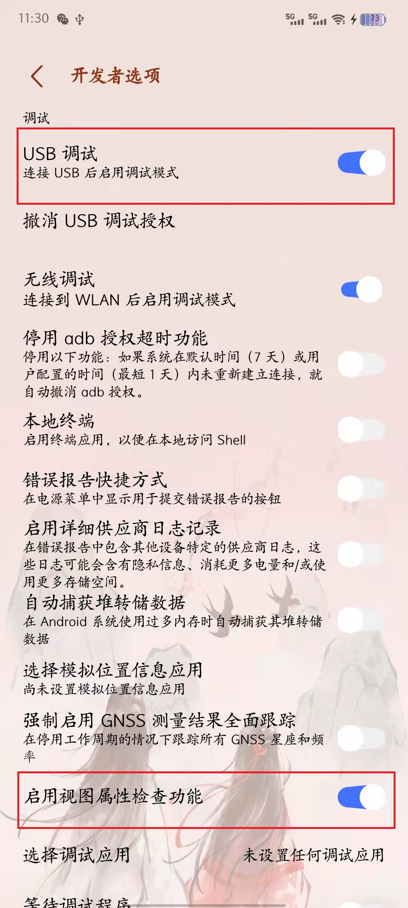
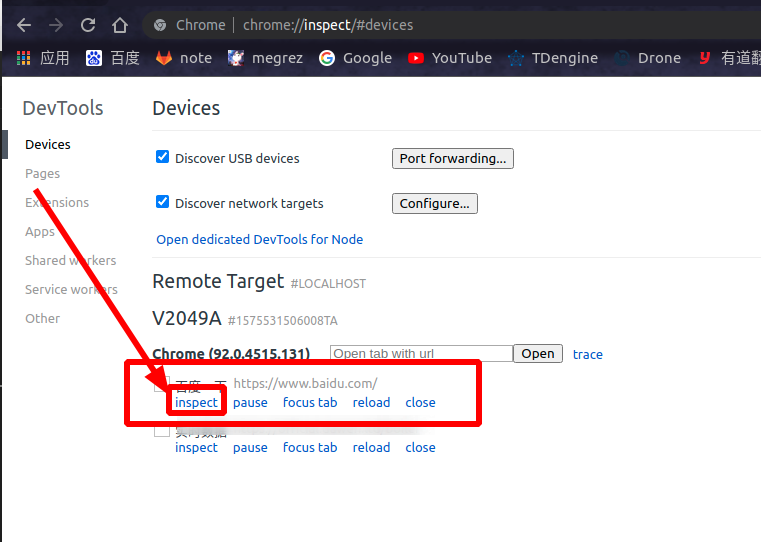
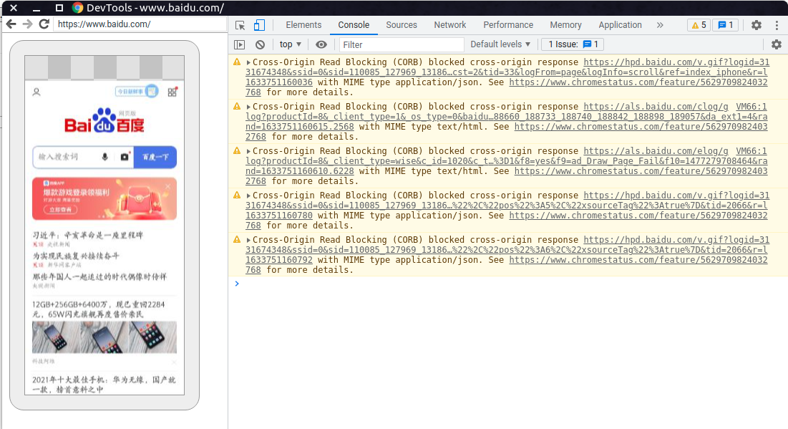

# Chrome 调试手机端网页

## 目的

## Step1. 开启USB调试功能

开启**USB调试**功能，在调试配置时，要注意勾选 `启用视图属性检查功能` 。



> [!tip|label:提示]
> 一般新手机**默认**是没有USB调试功能的，需要开启**开发者模式**才能看到这个功能，开启开发者功能的方式是**连续点击系统软件版本**（在设置里面找到，每个手都不一样，如果实在找不到就上网搜，xxx手机如何进入开发者模式）。


之后手机与电脑用**USB线**连接，连接后一般会弹出指纹认证信息，勾选**信任**即可。

> [!tip|label:提示]
> USB线出问题的概率也很大！最好用原装充电器上的线。


## Step2. Chrome浏览器配置

在**手机浏览器**中打开任意网页，例如 `www.baidu.com` ，接下来在**电脑Chrome浏览器**地址栏中输入： `chrome://inspect/#devices` ，就能看到手机中打开的网页了，如下所示：



接下来点击 `inspect` 按钮，就开始了调试功能，如下所示：



## 番外

### 局域网WiFi调试

首先通过USB数据线连接到电脑，并正常开启USB调试功能，进行如下操作：

```shell
$ adb devices
List of devices attached
1575531506008TA	device

$ adb devices
List of devices attached
1575531506008TA	device

$ adb tcpip 5555
restarting in TCP mode port: 5555

$ adb connect 192.168.3.160:5555
connected to 192.168.3.160:5555

$ adb devices
List of devices attached
192.168.3.160:5555	device
```

> [!tip|label:提示]
> 台式机没有无线网卡是不行的哦！

