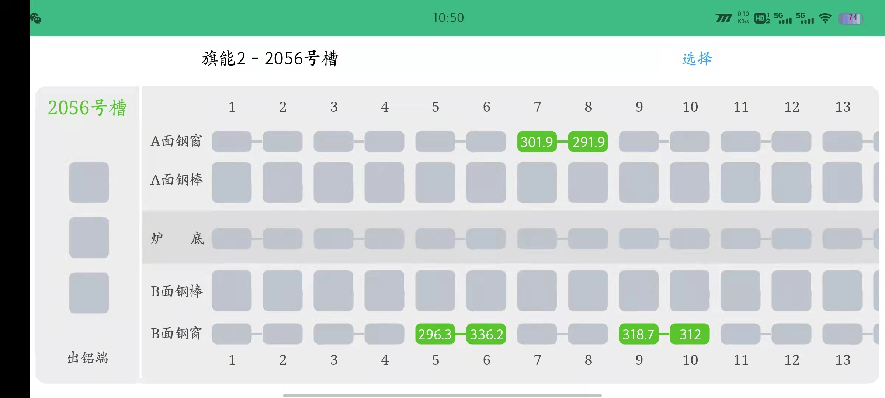
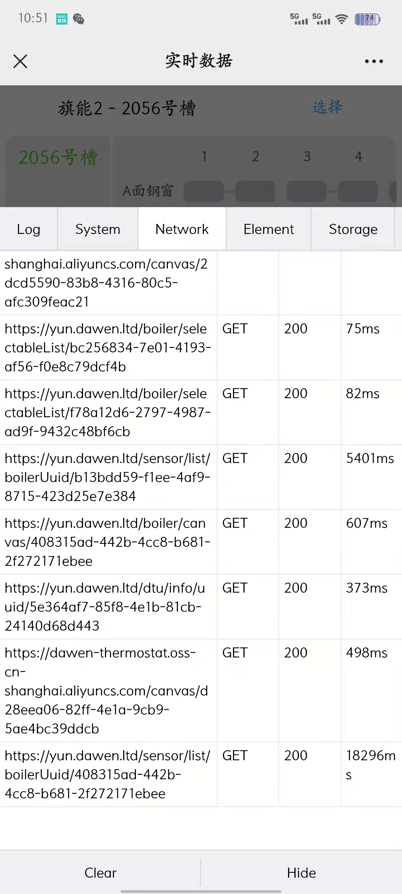
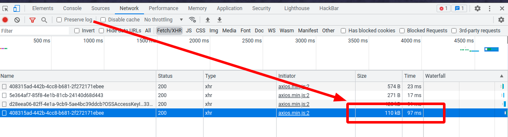
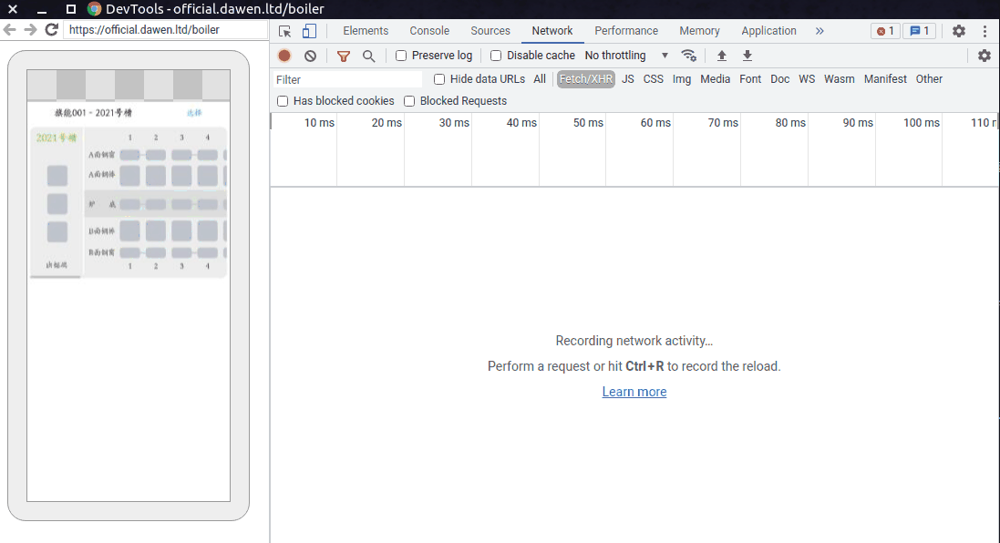
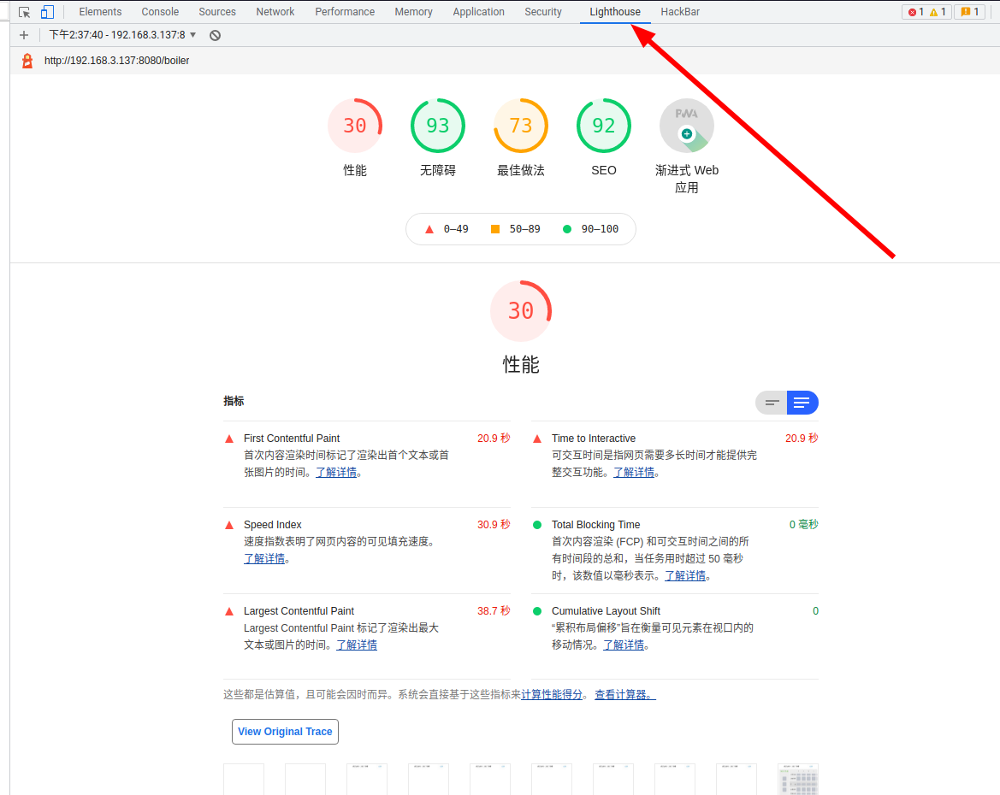

# 手机端接口反应慢

## 场景

用户突然反馈一个页面的渲染太慢了，要将近半分钟，此网页不是普通的展示网页，用到了 `canvas` 来渲染，所以问题定位比较麻烦，网页如下所示：

## 问题分析

由于是公众号网页，首先想到的是[打开微信内置浏览器的vConsole功能](../../微信公众号/小技巧/开启debug模式/README.md)，打开后查看网络信息，如下所示：

从图中可以明显看出，最后一个接口的请求耗时达到了 `18296ms` ，也就是 `18秒` 多！初步发现问题。

接下来考虑是否为微信环境独有的问题，在**手机端Chrome浏览器**中打开这个网页同样很卡，那可以证明不是微信独有的问题。

接下来考虑是否是移动端独有的问题，将网页在**电脑Chrome浏览器**中打开，发现很快，几乎是**秒开**，网络信息如下：

那么就将这个问题的边界摸清楚了，**只有在移动端会有这个问题**。

接下来为了更加详细的拿到网页运行信息，采用[电脑Chrome调试移动端网页](../chrome调试手机端网页/README.md)的方式来实时监控网页信息，结果发现了诡异的事情，请完整看完下面的 `GIF` （有半分钟多）

可以看到，那个很耗时的http请求在这里就变得非常诡异了，首先是一直处于 `Pending` 状态，之后结束后是 `30s` 多，然后变成了 `361ms` ，这个就很诡异了。

继续，我们更加深入的分析一下网站，采用 `devtool` 中的 `lighthouse` 功能来分析，得到的分析结果惨不忍睹，如下所示：

相关结果报告可查看：[网站分析结果.html](https://megrez-file.virtualbing.fun/Web/%E5%AE%9E%E8%B7%B5%E7%A7%AF%E7%B4%AF/%E6%89%8B%E6%9C%BA%E7%AB%AF%E6%8E%A5%E5%8F%A3%E5%8F%8D%E5%BA%94%E6%85%A2/%E7%BD%91%E7%AB%99%E5%88%86%E6%9E%90%E7%BB%93%E6%9E%9C.html)

继续深入分析，使用 `devtool` 中的 `Performance` 功能来分析网站，分析结果：[Performance分析结果.json](https://megrez-file.virtualbing.fun/Web/%E5%AE%9E%E8%B7%B5%E7%A7%AF%E7%B4%AF/%E6%89%8B%E6%9C%BA%E7%AB%AF%E6%8E%A5%E5%8F%A3%E5%8F%8D%E5%BA%94%E6%85%A2/Performance%E5%88%86%E6%9E%90%E7%BB%93%E6%9E%9C.json)
