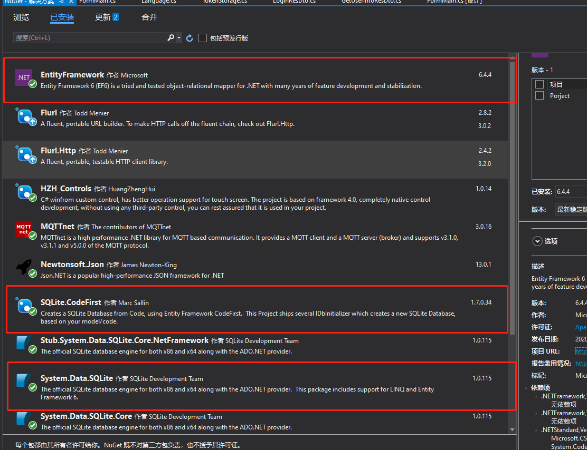
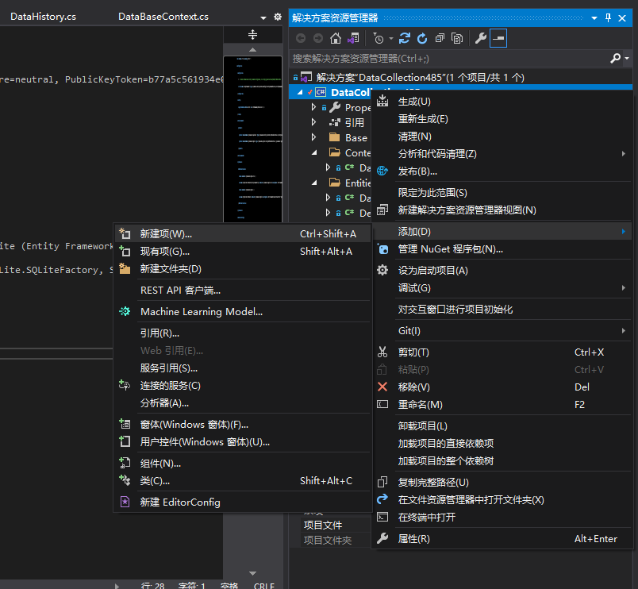
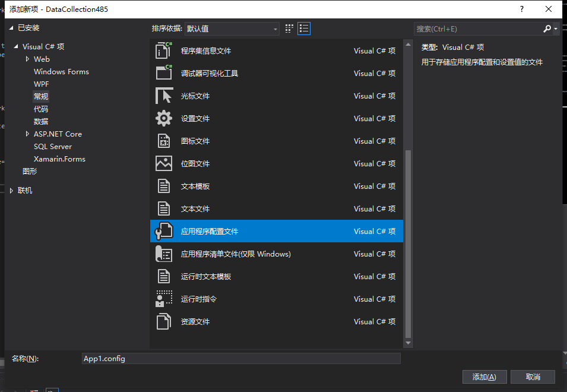

# WinForm集成EntityFramework（基于. NetFramework 4.6)

## 安装所需NuGet包

* [EntityFramework](https://github.com/dotnet/ef6/wiki)
* [System. Data. SQLite](https://system.data.sqlite.org/)
* [SQLite. CodeFirs](https://github.com/msallin/SQLiteCodeFirst)

如下图所示：



::: tip 提示
安装 `System.Data.Sqlite` 时会同时安装 `System.Data.Sqlite.EF6` 、 `System.Data.Sqlite.LINQ` 、 `System.Data.Sqlite.Core` 这些包之后不需要单独安装
:::

## 配置App.config文件

如果项目中有 `App.config` 文件，安装 `NuGet` 包后就会自动配置，没有则需要自己新建，新建流程：





内容如下：

```xml
<?xml version="1.0" encoding="utf-8"?>
<configuration>
  <configSections>
    <!-- For more information on Entity Framework configuration, visit http://go.microsoft.com/fwlink/?LinkID=237468 -->
    <section name="entityFramework" type="System.Data.Entity.Internal.ConfigFile.EntityFrameworkSection, EntityFramework, Version=6.0.0.0, Culture=neutral, PublicKeyToken=b77a5c561934e089" requirePermission="false" />
  </configSections>
  <startup>
    <supportedRuntime version="v4.0" sku=".NETFramework,Version=v4.6" />
  </startup>
  <runtime>
    <assemblyBinding xmlns="urn:schemas-microsoft-com:asm.v1">
      <dependentAssembly>
        <assemblyIdentity name="Newtonsoft.Json" publicKeyToken="30ad4fe6b2a6aeed" culture="neutral" />
        <bindingRedirect oldVersion="0.0.0.0-13.0.0.0" newVersion="13.0.0.0" />
      </dependentAssembly>
    </assemblyBinding>
  </runtime>
  <entityFramework>
    <providers>
      <provider invariantName="System.Data.SqlClient" type="System.Data.Entity.SqlServer.SqlProviderServices, EntityFramework.SqlServer" />
      <provider invariantName="System.Data.SQLite" type="System.Data.SQLite.EF6.SQLiteProviderServices, System.Data.SQLite.EF6" />
    </providers>
  </entityFramework>
  <system.data>
    <DbProviderFactories>
      <remove invariant="System.Data.SQLite.EF6" />
      <add name="SQLite Data Provider (Entity Framework 6)" invariant="System.Data.SQLite.EF6" description=".NET Framework Data Provider for SQLite (Entity Framework 6)" type="System.Data.SQLite.EF6.SQLiteProviderFactory, System.Data.SQLite.EF6" />
      <remove invariant="System.Data.SQLite" />
      <add name="SQLite Data Provider" invariant="System.Data.SQLite" description=".NET Framework Data Provider for SQLite" type="System.Data.SQLite.SQLiteFactory, System.Data.SQLite" />
    </DbProviderFactories>
  </system.data>
  <connectionStrings>
    <add name="DataBase" connectionString="Data Source=DataBase.db" providerName="System.Data.SQLite.EF6" />
  </connectionStrings>
</configuration>
```

::: tip 提示
如果之前有 `App.config` 文件，则需要配置最后的 `connectionStrings` 字段，这个是**连接字符串**。

同时，将默认生成的配置
```xml
<provider invariantName="System.Data.SQLite.EF6" type="System.Data.SQLite.EF6.SQLiteProviderServices, System.Data.SQLite.EF6" />
```
修改成
```xml
<provider invariantName="System.Data.SQLite" type="System.Data.SQLite.EF6.SQLiteProviderServices, System.Data.SQLite.EF6" />
```
如果此处不进行修改，则在运行的时候会出现如下错误：


:::
