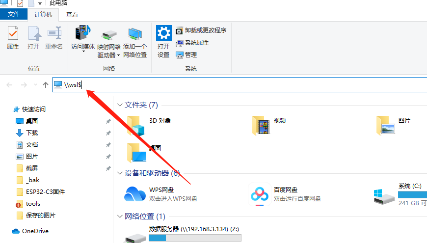
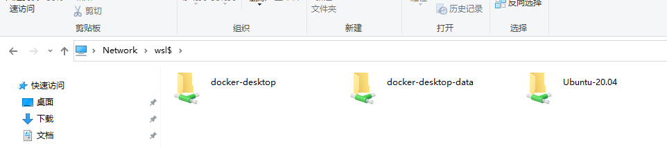

# 文件管理器

## 需求

在 `Windows` 下的用户习惯了图形化的操作方式，但是我们使用 `WSL` 后是没有图形化界面的，只能通过命令行来操作 `Linux` 子系统，类似于服务器。如果能够通过文件资源管理器来查看 `Linux` 子系统下面的文件与文件夹无异于更加地方便。

## 方式一

在文件资源管理器中的地址栏输入： `\\wsl$` 命令，就能进入到 `WSL` 的文件系统中了，如下所示：



回车后如下所示：



## 方式二

在 `WSL` 终端中输入如下命令：

```bash
$ explorer.exe .
```
