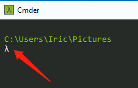
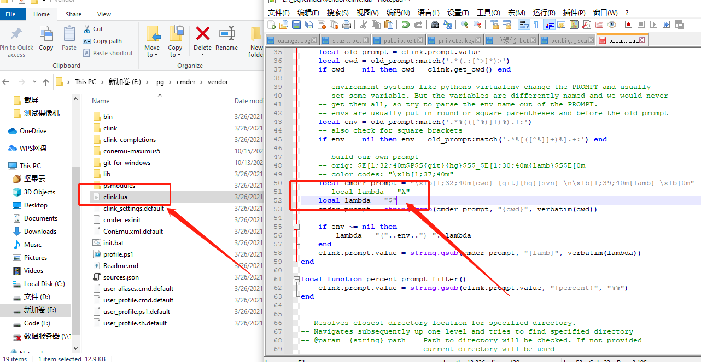
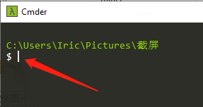
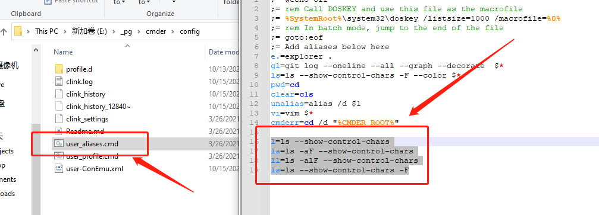

# 个性化配置

## 修改 `λ` 为 `$`

默认样式为 `λ` 开始，如下所示：



在 `Linux` 下习惯了用 `$` 开头（ `$` 是默认 `bash` 的样式），因此将 `cmder` 的标识符也修改成 `$` ，保持和 `Linux` 一样的风格。

找到 `cmder` 目录下的 `vendor` 文件夹中的 `clink.lua` 文件，修改 `local lambda` 值即可，如下所示：



之后在打开 `cmder` 标识符就变成了 `$` ，如下所示：



## 添加常用命令

找到 `cmder` 目录下的config文件夹中的user_aliases.cmd文件，编辑，在文件末尾添加如下内容：

```bash
l=ls --show-control-chars
la=ls -aF --show-control-chars
ll=ls -alF --show-control-chars
ls=ls --show-control-chars -F
```

如下所示：


