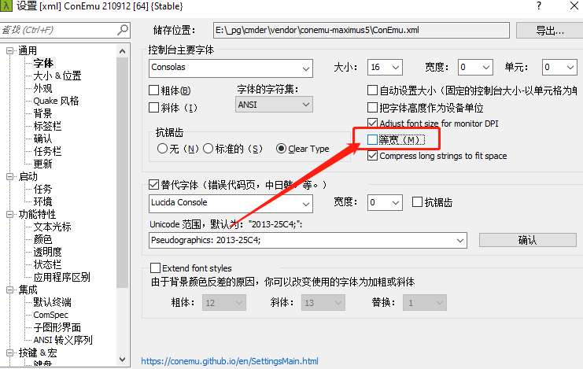

# 安装

从[官网](https://cmder.net/)下载压缩包，下载 `full` 版本的，下载下来是一个 `zip` 文件，移动到软件安装目录，解压。

## 配置

双击 `Cmder.exe` 就能运行。常用需求是最好能从**右键菜单**打开 `Cmder` ，或者是一个简单的**快捷键**打开，因此 `Cmder` 提供了**注册功能**。

在 `Cmder.exe` 文件上**右键**，选择**以管理员身份运行**，之后输入 `$ cmder /register all` 命令即可，如下所示：

```PowerShell
E:\_pg\cmder
λ cmder /register all
```

之后就能在右键菜单中看到 `Cmder` 了。

类似于 `Ubuntu` 下的 `Ctrl + Alt + T` 快捷键调出终端方式还未研究出来。

## Bug修改

### 防止字符重叠

打开 `cmder` **控制台**，选择**字体**菜单，取消**等宽**设置。



## 提示

安装完成 `Cmder` 后会对 `VSCode` 的**终端**产生一定的影响，即在 `Cmder` 终端开启的情况下，使用快捷键就没要办法打开内置终端了，只能打开 `Cmder` 活动中的终端了，可以考虑将 `VSCode` 的终端换成 `Cmder` ，具体可[参考笔记](../../../../IDE/VSCode/Windows下使用cmder终端.md)
