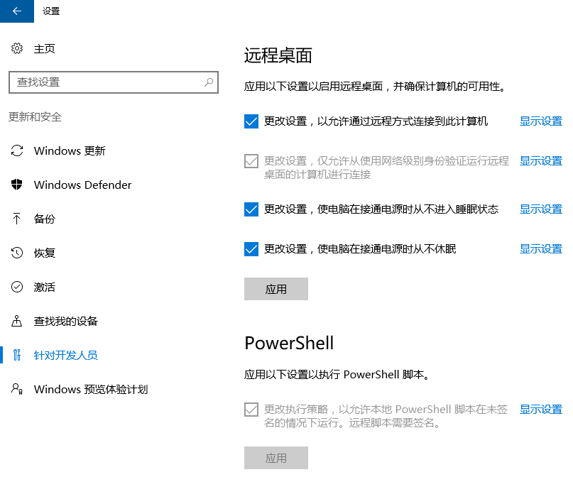

# 策略

由于 `PowerShell` 主要是运行脚本，微软出于安全考虑，限制了脚本的运行策略，默认的模式是 `AllSigned` ，即： **所有注册策略。要求所有脚本和配置文件被信任的注册商注册，包括你写的本地脚本**。这就会导致很多脚本无法运行。

## 模式

`PowerShell` 提供以下几种策略模式：
* `Restricted`：限制策略，默认设置不会加载配置文件或执行脚本。
* `AllSigned`：所有注册策略。要求所有脚本和配置文件被信任的注册商注册，包括你写的本地脚本。（**默认**）
* `RemoteSigned`：远程注册策略。要求所有从远程网络下载的脚本和配置文件被信任的远程供应商注册过。
* `Unrestricted`：不限制策略。加载所有配置文件和运行所有脚本。如果你运行一个未注册脚本来自网络，它将提示是否允许执行。
* `Bypass`：通过策略。无阻塞，无提示和警告。
* `Undefined`：未定义策略。去除当前范围指定的执行策略，返回会话默认策略。

## 获取策略模式

以**管理员身份**运行 `PowerShell` ，执行以下命令：

```PowerShell
> get-ExecutionPolicy
AllSigned
```

## 更改策略（永久有效）

以**管理员身份**运行 `PowerShell` ，执行以下命令：

```PowerShell
> Set-ExecutionPolicy Bypass
```

## 更改策略（只对本终端有效）

以**管理员身份**运行 `PowerShell` ，执行以下命令：

```PowerShell
> Set-ExecutionPolicy -Scope Process -ExecutionPolicy Bypass
```

::: tip 提示
作为开发，我们选择Bypass模式即可。
:::

## 更改策略（永久有效）

打开**设置**，找到**针对开发人员**部分，设置PowerShell，勾选，然后应用即可。


