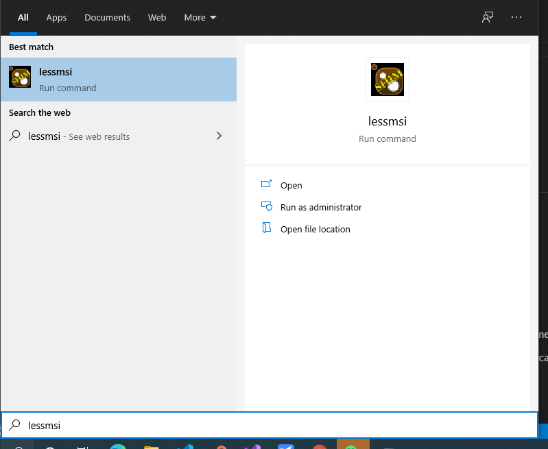
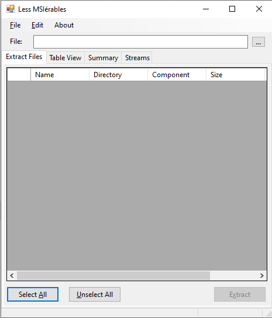

# msi文件解包

## 实现方式

采用 `lessmsi` 软件进行解包，[GitHub地址](https://github.com/activescott/lessmsi)

## lessmsi安装

推荐使用[Chocolatey](../系统配置/Chocolatey/README.md)进行安装，安装命令：

```bash
$ choco install lessmsi
```

## 解包——命令行模式

在文件目录打开 `PowerShell` ，执行解压命令：

```PowerShell
F:\msi path> lessmsi x xxx.msi
```

关于 `lessmsi` 的命令行使用请查看[官方文档](https://github.com/activescott/lessmsi/wiki/Command-Line)

## 解包——GUI方式

在 `Windows Search` 中搜索 `lessmsi` ，打开即可，如下所示：



打开后软件运行如下所示：



接下来了选择msi文件，并解压即可，如下所示：


