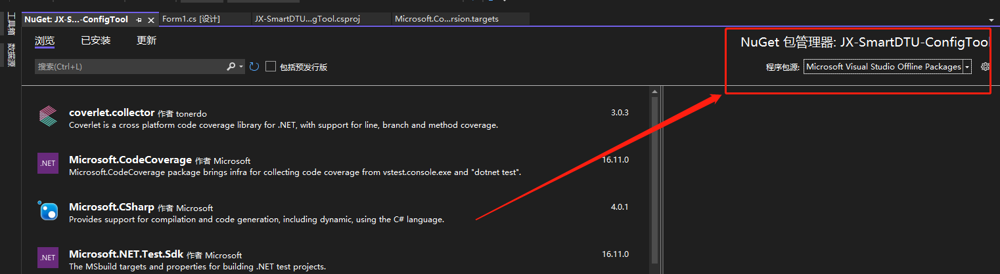
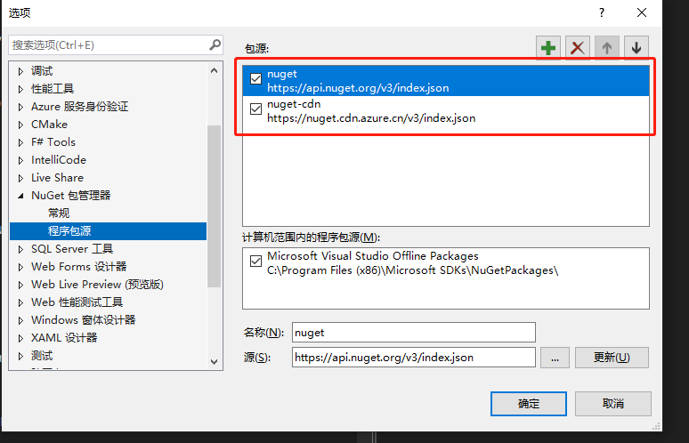

# 源

在 `vs` 新装的时候可能会遇到打开一个老项目出现 `NuGet` 包版本找不到，并且只能搜索到很早的版本的情况。此类问题出现的原因就是 `NuGet` 源不正确，一般为只有 `Microsoft Visual Studio Offline Packages` 源。

## 解决方案

添加**在线源**即可，打开 `NuGet` 控制台，点击右上角的程序包源设置按钮，如下所示：

之后添加 `NuGet` 源即可，如下所示：

> [!tip|label: 可用源]
> - https://api.nuget.org/v3/index.json
> - https://nuget.cdn.azure.cn/v3/index.json
