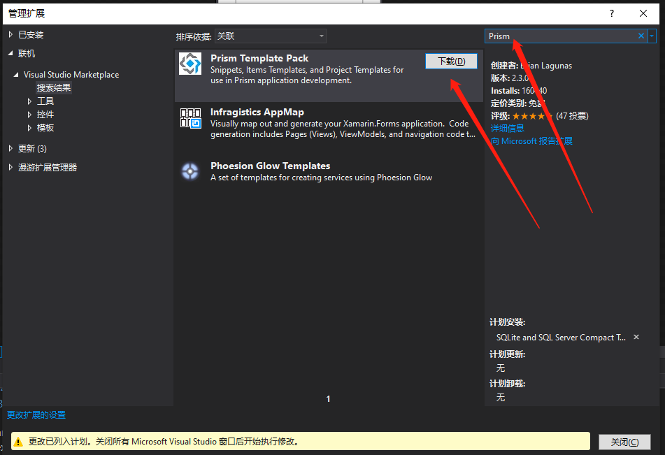
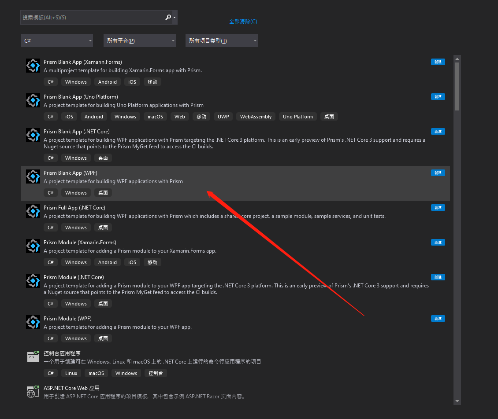
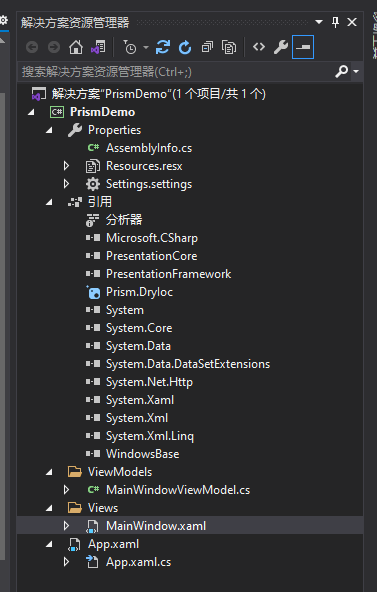

# 在项目中引入Prism

## 通过vs扩展插件创建项目

`Prism` 提供 `vs` 的扩展插件，这个插件可以直接初始化一个工程，里面的内容已经配置好了的。

### 安装

扩展插件可以从插件市场下载并进行安装，[插件市场地址](https://marketplace.visualstudio.com/items?itemName=BrianLagunas.PrismTemplatePack)，也可以通过菜单： `扩展` ——> `管理扩展` 打开扩展管理页面，并搜索 `Prism` 关键字就能搜索到插件，如下所示：

安装后重启即可。

### 新建项目或模块

通过上述方法安装完成插件后，就可以通过这个插件来新建项目或模块了，如下所示：

之后的 `Ioc` 容器选择 `DryIoc` 即可，关于 `DryIoc` 和 `Unity` 的区别请转至[笔记](./基础篇/DryIoc_vs_Unity.md)

最终建立的项目结构如下所示：

> [!tip|label:吐槽]
> 不愧为官方出品，这个插件做的这么丰满。

## 旧项目引入