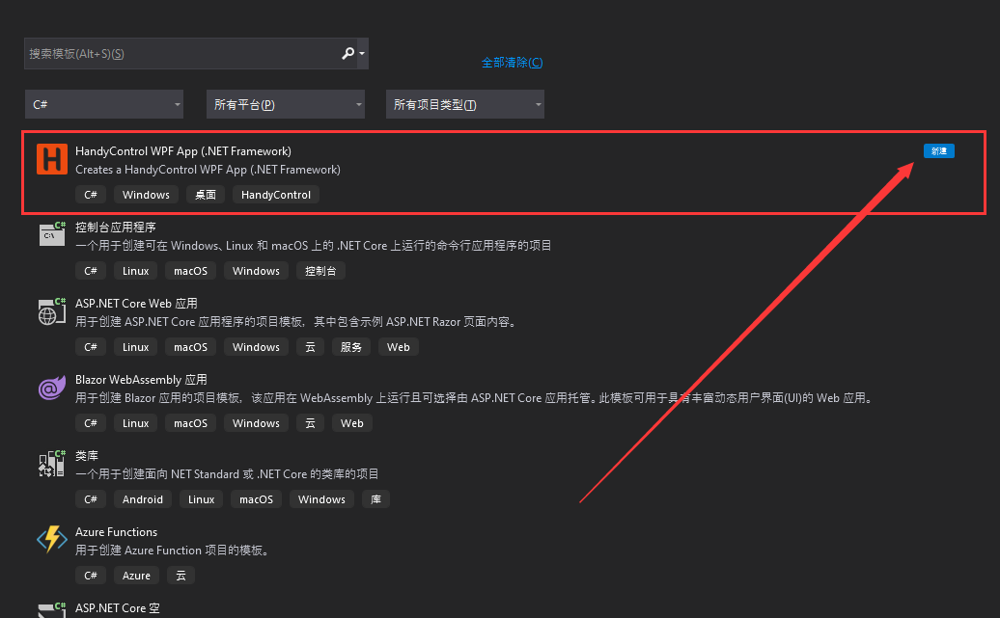

# VS2019 插件

[下载地址](https://marketplace.visualstudio.com/items?itemName=HandyOrg.HandyControl)

::: tip 提示
在安装这个插件的时候要**退出vs**，否则就会一直处于安装状态！
:::

## 作用

安装完成 `HandyControl for VS2019` 插件之后，在新建项目的时候就能够直接建立此模板的工程项目了，如下所示：

::: tip 提示
通过此方式创建的工程可能会直接报错，原因是**HandyControl的版本过低了**，在 `Nuget` 控制台升级一下 `HandyControl` 的版本即可。
:::
