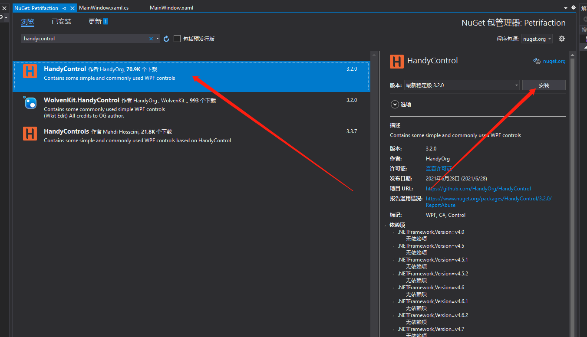

# 旧项目集成

## 旧项目环境

使用 `Prism` 扩展生成的 `WPF` 应用程序（采用 `DryIoc` 作为 `Ioc` 容器）

## Step1. 安装HandyControl包

打开 `Nuget` 包管理器，搜索 `HandyControl` ，安装，如下所示：



## Step2. 修改App.xaml

打开项目的 `App.xaml` 文件，加入如下资源字典内容：

```xml
<Application.Resources>
    <ResourceDictionary>
        <ResourceDictionary.MergedDictionaries>
            <ResourceDictionary Source="pack://application:,,,/HandyControl;component/Themes/SkinDefault.xaml"/>
            <ResourceDictionary Source="pack://application:,,,/HandyControl;component/Themes/Theme.xaml"/>
        </ResourceDictionary.MergedDictionaries>
    </ResourceDictionary>
</Application.Resources>
```

## Step3. 添加命名空间

在页面xaml文件中添加命名空间 `xmlns:hc="https://handyorg.github.io/handycontrol"`
