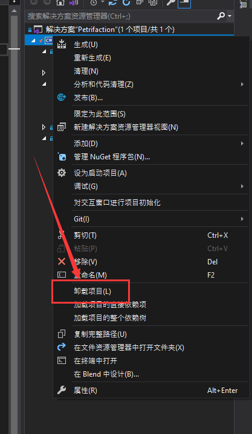
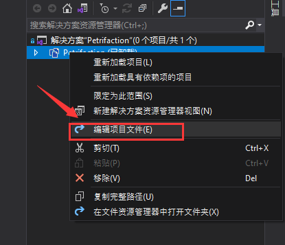
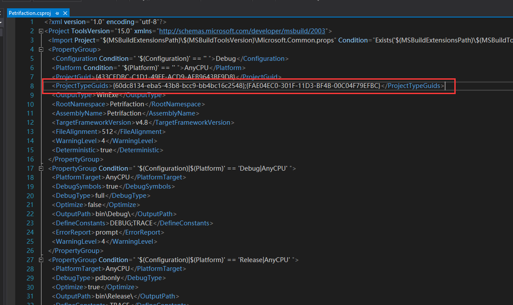
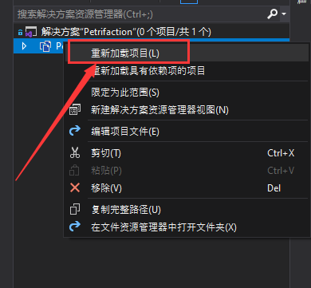
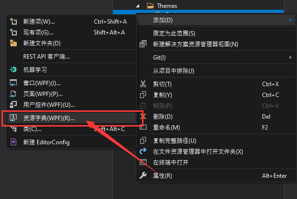

# 新建项无资源字典类型

## 产生场景

我通过 `HandyControl` 的**vs插件**创建的工程，之后想添加资源字典的时候发现新建项中怎么也找不到这个类型。

## 解决方法

### Step1. 卸载项目

在解决方案上右键，选择 `卸载项目` ，如下所示：



### Step2. 编辑项目文件

在卸载后的项目上右键，选择 `编辑项目文件` ，如下所示：



### Step3. 添加项目配置

在项目的配置文件中，添加如下内容：

```xml
<ProjectTypeGuids>{60dc8134-eba5-43b8-bcc9-bb4bc16c2548};{FAE04EC0-301F-11D3-BF4B-00C04F79EFBC}</ProjectTypeGuids>
```

如下图所示：



### Step4. 重载项目

保存修改，并在项目上右键，选择 `重新加载项目` ，如下所示：



### Step5. 测试

经过如上步骤，已经修改好了项目，接下来进行一下测试



修改完成！
