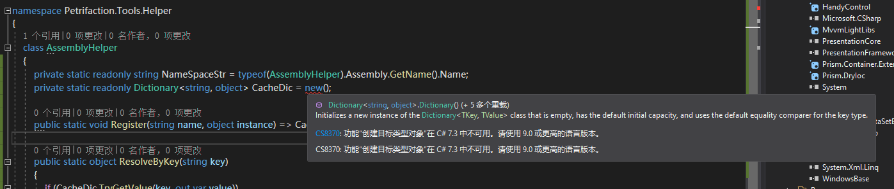
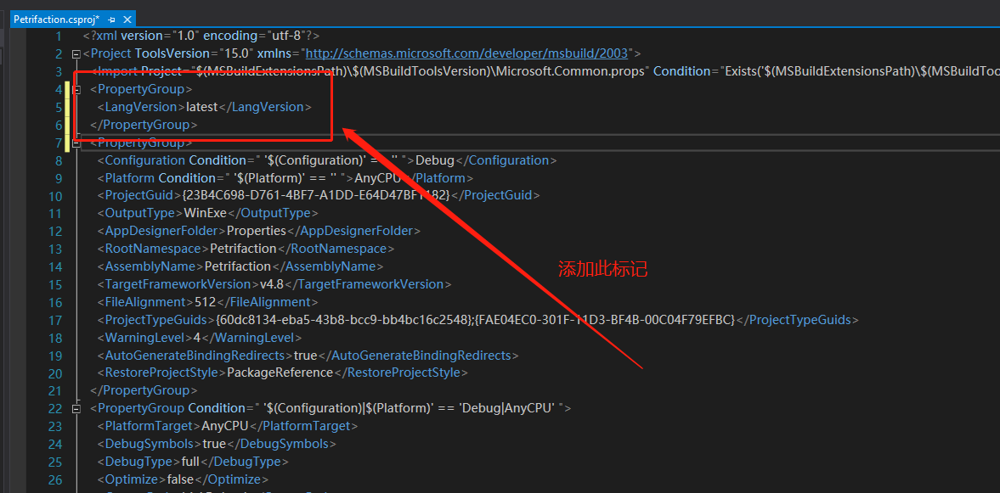

# 创建目标类型对象在C#7.3中不可用，请使用9.0或更高的语言版本

## 问题出现场景

在项目中使用新版语法时就会出现这种情况，问题场景如下所示：



## 解决方法

很显然，提升一下项目配置的 `C#` 语言版本即可。

首先，在**解决方案资源管理器**中**右键点击**项目，选择**卸载项目**，卸载完成后再次右键，选择**编辑项目文件**，在项目文件中加入如下语言版本配置信息

```xml
<PropertyGroup>
  <LangVersion>latest</LangVersion>
</PropertyGroup>
```

如下所示：



保存之后重新加载项目

::: tip 提示
重新加载后有可能语言版本没有起作用，如果没有起作用，**重启vs**即可。
:::