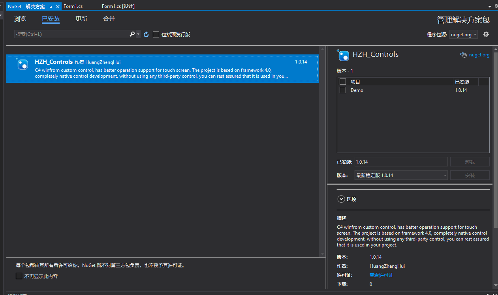
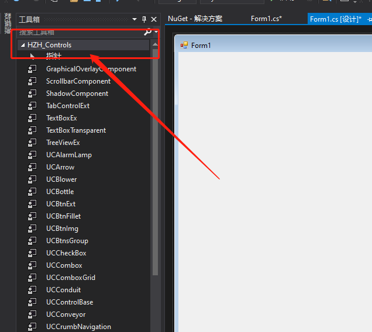

# 安装

## NuGet安装

命令方式安装，打开 `NuGet` 控制台，输入如下命令：

```shell
$ Install-Package HZH_Controls
```

或者在**包管理器**中搜索并安装，如下所示：



正常安装完成后，可以在**工具箱**中看到 `HZControls` 的控件了，如下所示：



::: warning 思考
`HZHControls` 没看到依赖项，意思是 `. Net Framework` 和 `. Net Core` 都可以使用吗？
:::
