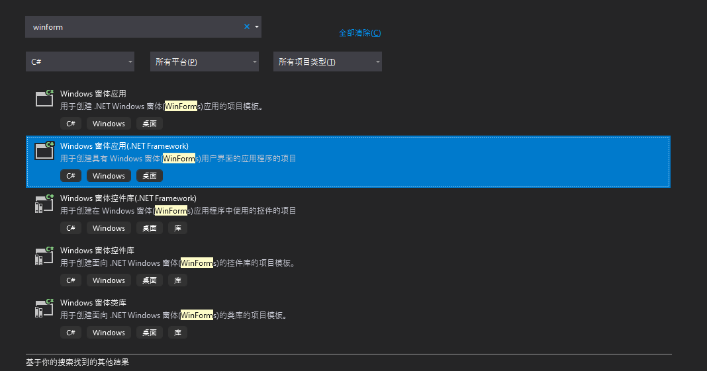
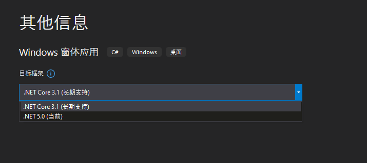
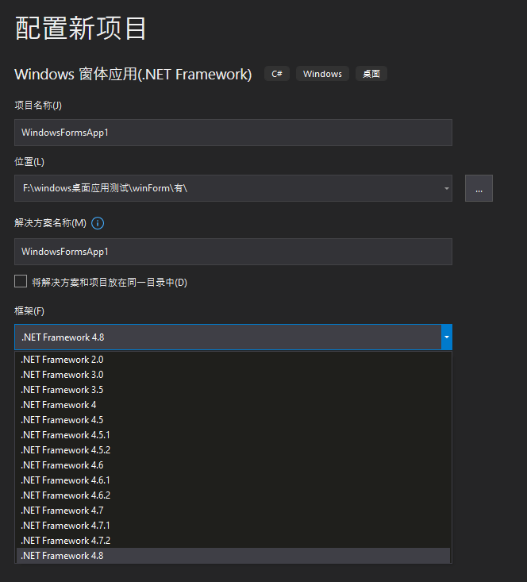

# Windows窗体应用 vs Windows窗体应用(. NetFramework)

在通过 `VirtualStudio` 创建 `WinForm` 项目的时候，通常有两个选项，如下所示：

## Windows窗体应用

此种应用的底层是基于 `. Net Core` 的，后续操作需要选择 `. Net Core` 版本，如下所示：

## Windows窗体应用(. NetFramework) 

此种应用的底层是基于 `. NetFramework` 的，后续操作需要选择 `. Net Framework` 版本，如下所示：

## 如何选择

微软确实正在逐步切换到 `. Net Core` ，但据说 `. Net Core` 对 `WinForm` 有所阉割，性能方面 `. Net Core` 占有优势，但是我们的 `winForm` 对性能需求不高，所以，还是选择 `. NetFramework` 吧，生态好，开发快。

> [!tip|label: 提示]
> 有人说 `.Net Core` 才是未来，我都用 `winForm` 了，还在意未来？
