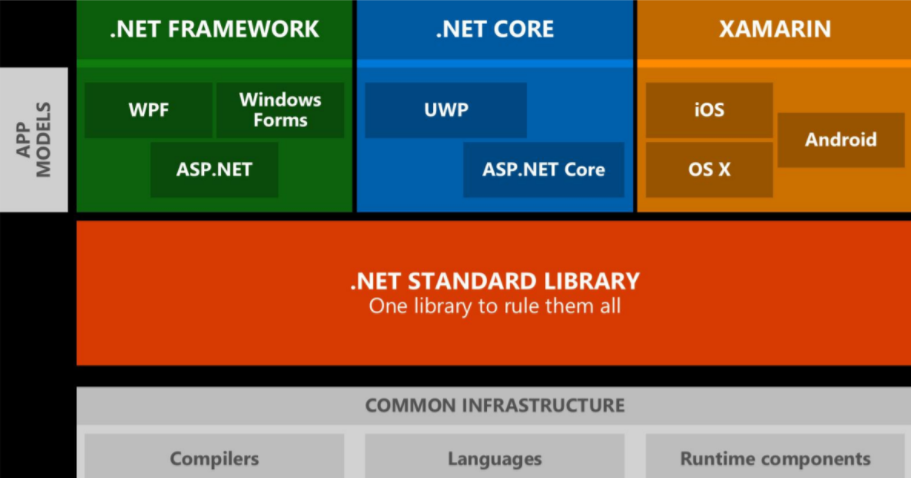

# `. Net Standard` vs `. Net Framework` vs `. Net Core` vs `. Net5+`

## 前言

在Windows开发桌面应用程序中，新建项目一般要选择是基于 `. Net Framework` 还是基于 `. Net Core` 的，同时又有一个叫 `. Net Standard` 的东西，微软又新出了一个叫 `. Net5` 的东西。。。让人非常迷惑，对初学者很不友好，不知道要如何选择。本文重点介绍这四者的区别。

## 关系

## . Net Framework

`. Net Framework` 主要由两部分组成：

*  公共语言运行时（`CLR`）处理应用程序
*  基础类库（`BCL`）这是可重用的代码库

`. Net Framework` 在执行的过程中编写的代码将会编译成一种称为**中间语言**（ `IL` ）存储形式以 `DLL` 和 `EXE` 后缀名结尾的文件为主，当程序运行时 `CLR` 会编译转换为**机器代码**。由于微软早期的战略， `. Net Framework` 本身不是跨平台的，也就是话说仅限于运行在Windows 平台，想要跨平台需要借助第三方。

## . Net Core

`. Net Core` 的出现就是为了适应软件开发的趋势，因为各种不同的设备还有云计算的出现，其他的操作系统使用量也有所增加，如果 `. Net` 不发生改变也就意味着市场将会越来越小。 `. Net Core` 的出现用于满足当前以及未来软件开发的需求。

`. Net Core` 是一个全新的框架，是 `. Net` 的跨平台的实现，它和 `. Net Framework` 有很多共同的特性，这也就意味着 `. Net Framework` 从业者转到 `. Net Core` 将会变的很简单。

|. NET Standard|	[1.0](https://github.com/dotnet/standard/blob/master/docs/versions/netstandard1.0.md)|	[1.1](https://github.com/dotnet/standard/blob/master/docs/versions/netstandard1.1.md)|	[1.2](https://github.com/dotnet/standard/blob/master/docs/versions/netstandard1.2.md)|	[1.3](https://github.com/dotnet/standard/blob/master/docs/versions/netstandard1.3.md)|	[1.4](https://github.com/dotnet/standard/blob/master/docs/versions/netstandard1.4.md)|	[1.5](https://github.com/dotnet/standard/blob/master/docs/versions/netstandard1.5.md)|	[1.6](https://github.com/dotnet/standard/blob/master/docs/versions/netstandard1.6.md)|	[2.0](https://github.com/dotnet/standard/blob/master/docs/versions/netstandard2.0.md)|	[2.1](https://github.com/dotnet/standard/blob/master/docs/versions/netstandard2.1.md)|
|-----|-----|-----|-----|-----|-----|-----|-----|-----|-----|
|. NET	|5.0|	5.0|	5.0	|5.0	|5.0|	5.0	|5.0|	5.0|	5.0|
|. NET Core	|1.0|	1.0	|1.0|	1.0|	1.0|	1.0	|1.0|	2.0	|3.0|
|. NET Framework |	4.5|	4.5|	4.5.1|	4.6|	4.6.1|	4.6.1|	4.6.1 |	4.6.1| 	N/A|
|Mono	|4.6|	4.6|	4.6|	4.6|	4.6|	4.6|	4.6	|5.4|	6.4|
|Xamarin.iOS	|10.0|	10.0|	10.0|	10.0|	10.0|	10.0|	10.0|	10.14|	12.16|
|Xamarin. Mac	|3.0|	3.0|	3.0	|3.0|	3.0|	3.0|	3.0|	3.8|	5.16|
|Xamarin. Android	|7.0|	7.0|	7.0|	7.0|	7.0|	7.0|	7.0|	8.0|	10.0|
|通用 Windows 平台	|10.0|	10.0|	10.0|	10.0|	10.0|	10.0.16299|	10.0.16299|	10.0.16299|	待定|
|Unity	|2018 年 1 月|	2018 年 1 月|	2018 年 1 月|	2018 年 1 月|	2018 年 1 月|	2018 年 1 月|	2018 年 1 月|	2018 年 1 月|	2021.2.0b6|
