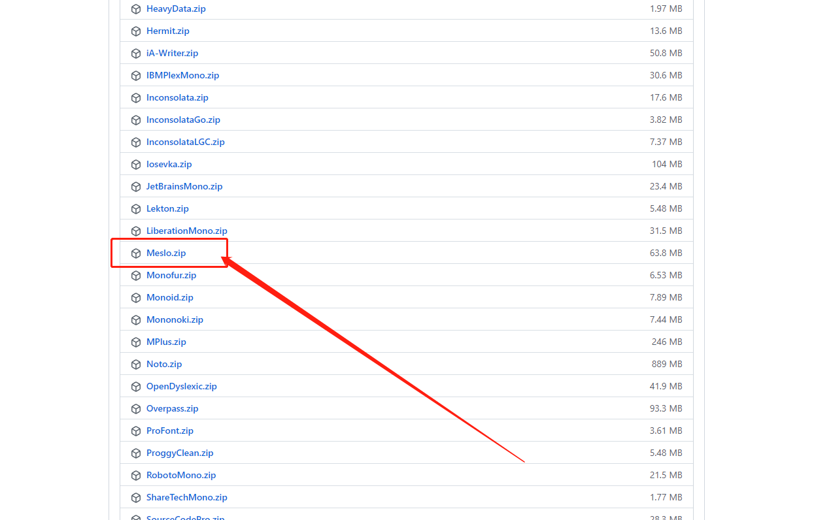
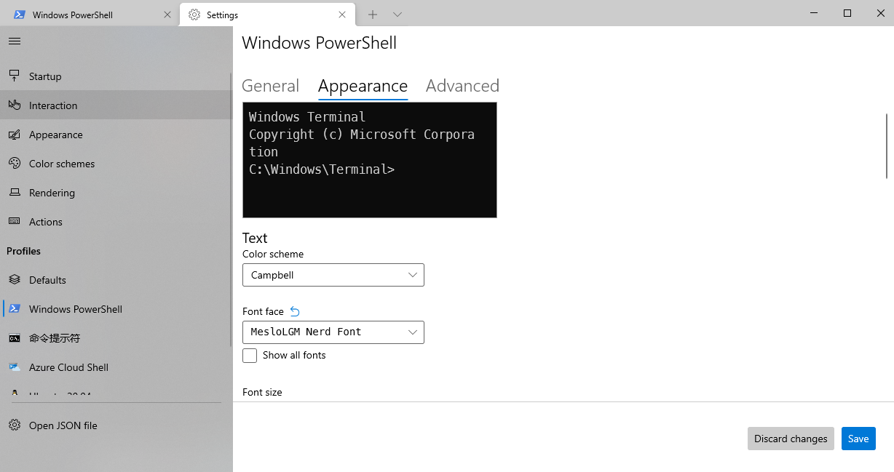

# 个性化配置

## 字体

### 下载安装

默认修改主题后字体图标显示会有问题，所以需要程序员专用字体，[官方字体文档](https://ohmyposh.dev/docs/fonts)。

官方推荐 `MesloLGM NF` 字体，因此我也使用这个字体，[GitHub地址](https://github.com/ryanoasis/nerd-fonts)

下载之后解压，将字体文件全部拷贝到 `C:\Windows\Fonts` 目录下即可完成安装。

### 终端设置

通过 `Windows Terminal` 设置 `PowerShell` 的字体为 `MesloLGM NF` 即可，如下所示：

