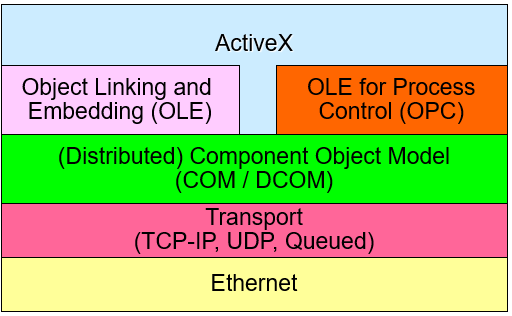
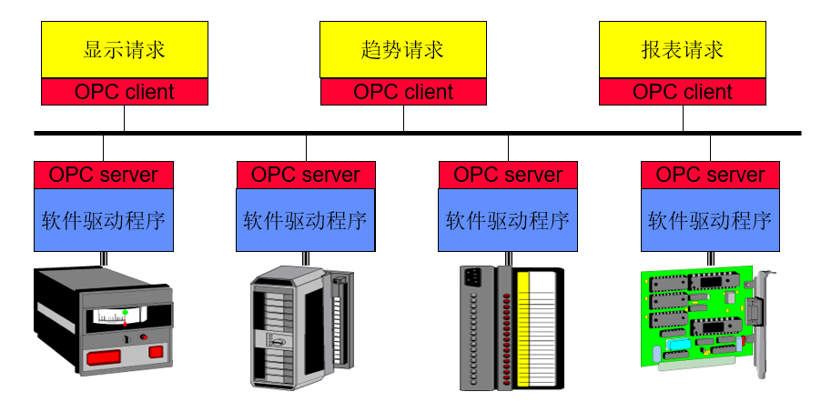
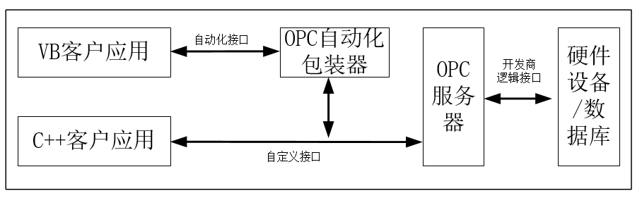
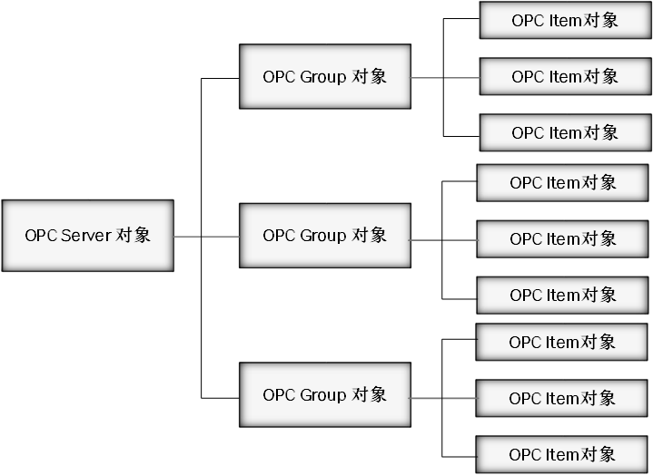
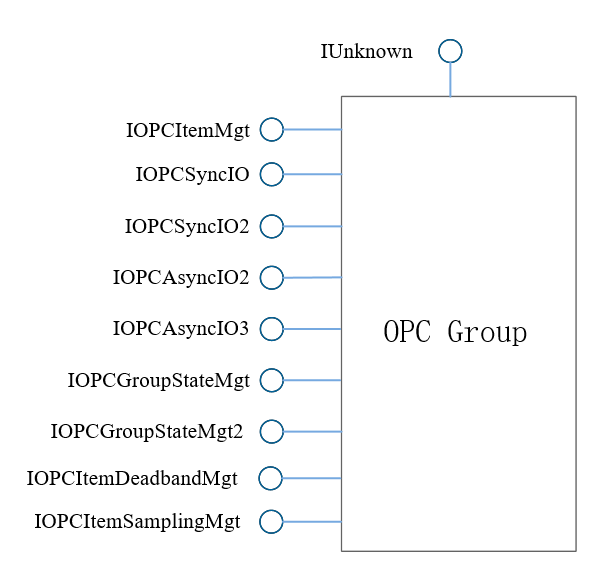

# OPC

## 产生场景

在过去，工业网络环境中有多种数据源（ `PLC` 、 `DCS` 、 `RTU` 、数据库等），多种传输媒介（以太网、串口通信、无线通讯等），多种过程控制软件部署环境（ `windows` 、 `Linux` 、 `Unix` 等），为了能存取现场设备的数据信息，每一个应用软件开发商都需要编写专用的接口函数。由于市场上的工业控制设备的品牌、型号、种类多种多样，给产品的开发商的开发工作和企业用户的使用都带来了很大的负担。而且特定应用的驱动程序不支持硬件变化的特点也给工业控制软硬件的升级和维护带来不便。

另外，同一时间两个客户应用一般不能对同一个设备进行数据通信，同时对同一个设备进行操作可能会引起存取冲突甚至导致系统崩溃。在这样的市场需求推动下，设备的开发商和系统集成厂商都希望有一种更加高效、统一的规范，使系统和设备之间的通信更加开放和方便。 `OPC` 作为工**业过程控制软件的接口标准**由此产生。

## 概述

`OPC` （全称：**OLE for Process Control**，用于过程控制的 `OLE` ）是自动化行业用于数据安全交换的互操作性标准。可以使多个厂商的设备之间无缝传输信息。

`OPC` 标准于 `1996` 年 `OPC` 基金会首次发布，其目的是把 `PLC` 特定的协议（如 `modbus` ， `Profibus` 等）抽象成为标准化的接口，作为“**中间人**”的角色把其通用的“**读**”“**写**”要求转换成具体的设备协议；反之，以便 `HMI/SCADA` 系统可以对接控制设备。

最初， `OPC` 标准仅限于 `Windows` 操作系统。我们普遍说的 `OPC` 规范指的是 `OPC Classic` ，它是基于 `OLE` （对象连接与嵌入）、 `COM` （部件对象模型） 和 `DCOM` （分布式部件对象模型）技术发展而来， `OPC` 规范是行业供应商、软件开发者和终端用户共同制定的一系列接口、属性和方法标准，在制造业、石油天然气、电力、可再生能源等领域被广泛应用。

基于 `OPC Classic` 的成功， `OPC` 基金会在 `2008` 年推出了新的技术标准 `OPC UA` （**Unified Architecture**，统一架构），将各个 `OPC Classic` 规范的所有功能集成到一个可扩展的框架中， `OPC UA` 基于 `TCP/ IP socket` 传输层，独立于平台并且面向对象，是**下一代**的 `OPC` 标准。

> [!tip|label: 提示]
> 因为 `OPC UA` 是基于 `TCP/IP` 的，所以其与平台无关，不在局限于 `Windows` 环境，只要能实现标准 `TCP/IP` 协议的环境都可以使用 `OPC UA` 协议。

## OPC 架构

`OPC` 通信采用 `Client/Server` 的通信结构， `OPC Server` 由设备生产厂商提供，用于连接他们的 `PLC` 、现场总线设备、 `HMI/SCADA` 系统等， `OPC Client` 通过 `OPC` 标准接口对各 `OPC Server` 管理的设备进行操作，由客户端发出数据请求，当 `OPC Server` 接收到来自 `OPC Client` 的数据请求后会按照要求返回请求的数据。

`OPC Server` 与 `OPC Client` 的连接支持两种访问接口类型，**自动化接口**和**自定义接口**。

* 自动化接口是为基于脚本编程语言开发客户端应用而定义的标准接口，技术人员可以利用 `VB` 、 `Delphi` 等编程语言开发 `OPC Client` 应用。
* 自定义接口则是为 `C++` 等高级编程语言开发 `OPC Client` 应用而定义的标准接口。

## OPC 标准

|标准|主要版本|主要内容|
|-----|-----|-----|
| `OPC Data Access` | `V1.0` 、 `V2.0` 、 `V3.0` |数据访问规范|
| `OPC Alarm and Events` | `V1.10` 、 `V1.00` |报警与事件规范|
| `OPC Batch` | `V2.00` 、 `V1.00` |批量过程规范|
| `OPC Data Exchange` | `V1.00` |数据交换规范|
| `OPC Historical Data Access` | `V1.2` 、 `V1.0` |历史数据存取规范|
| `OPC Security` | `V1.00` |安全性规范|
| `OPC XML DA` | `V1.00` 、 `V0.18` | `XML` 数据访问规范|
| `OPC Complex Data` | `V1.0` |复杂数据规范|
| `OPC Commands` | `V1.0` |命令规范|

`OPC` 的标准规范由“**数据访问规范**”、“**报警与事件规范**”、“**批量过程规范**”、“**数据交换规范**”、“**安全性规范**”等一系列标准组成。当前应用较为成熟的 `OPC` 规范主要是“**数据访问规范**”、“**报警与事件处理规范**”和“**历史数据存取规范**”。

### OPC DA (数据访问)

**应用最为广泛**，可在多个供应商设备和控制应用程序之间实现数据交换，而不存在专有限制。在车间的 `PLC` 、现场的 `RTU` 、桌面 `PC` 上的软件应用程序等之间， `OPC` 服务器可以持续进行数据通信。

### OPC HAD（历史数据访问）

历史数据访问规范定义了可应用于历史数据、时间数据的查询和分析的方法。它定义了很多聚合的行为，是一些在检索数据时可以汇总特定时间域内各数据值的方法。它可以用来创建简单的趋势数据服务器和比较复杂的数据压缩与分析服务器，这些服务器能够提供汇总数据、历史更新、历史数据注释和回填。

### OPC AE（报警与事件）

是 `OPC` 基金会制定的用于将各系统之间共享报警和事件信息的方式标准化规范。借助这一标准， `AE` 客户端可以接收有关设备安全限制、系统错误和其他异常情况的警报和事件通知。

## OPC 对象

`OPC` 标准规定的 `OPC` 对象有三类， `OPC Server` （服务器对象）、 `OPC Group` （组对象）和 `OPC Item` （数据项对象）。

* `OPC Server`对象维护服务器的相关信息，并作为O`PC Group`对象的包容器，管理组对象。
* `OPC Group`对象作为`OPC Item`对象的包容器，管理`OPC Item`对象，向外提供`OPC Item`对象的数据访问服务。
* `OPC Item`对象标识了与`OPC`服务器中数据的连接，不能直接访问。

### OPC Server对象

`OPC Server` 记录了服务器的所有信息，一个服务器对应一个 `OPC Server` ，即一种设备的驱动程序，同时， `OPC Server` 作为 `OPC Group` 对象的容器，可以有多个组对象。

当客户程序访问 `OPC` 服务器时，首先会建立与 `OPC Server` 对象的连接，获取必要的信息后在建立 `OPC Group` 对象来访问 `OPC Item` 对象。 `OPC Server` 对象通过一些接口实现与客户端的数据交换。

除了 `COM` 本身的 `IUnknown` 接口外， `OPC Server` 对象有**五个接口**：

|接口|描述|
|-----|-----|
| `IOPCCommon` |用于处理服务器的基本信息，提供给客户设置和查询本地语言，查询错误说明的功能|
| `IOPCServer` |让客户程序管理服务器内部 `OPC` 组对象，包括添加、删除和查询等|
| `IOPBrowse` |负责浏览服务器地址空间的查询|
| `IOPCItemIO` |让客户程序不使用组对象直接读写数据|
| `IConnectionPointContainer` |用于实现与客户端的双向通信|

### OPC Group对象

`OPC Group` 对象提供了对服务器的数据进行组织管理，组是应用程序组织数据的一个单位，客户端得到组对象的接口指针后便可访问其提供的服务，包括读写 `OPC Item` 对象对应的数据、配置 `OPC` 服务器提供数据变化的速率等。

除了 `COM` 本身的 `IUnknown` 接口除外， `OPC Group` 对象有**九个接口**：

|接口|描述|
|-----|-----|
| `IOPCItemMgt` |用于管理 `Group` 内部 `Item` 对象|
| `IOPCGroupStateMgt` 、 `IOPCGroupStateMgt2` |负责管理 `Group` 对象本身的一些属性，主要是设置 `Group` 组织数据的方式|
| `IOPCSyncIO` 、 `IOPCSyncIO2` |实现数据的同步访问|
| `IOPCAsyncIO2` 、 `IOPCAsyncIO3` |实现数据异步访问|
| `IOPCItemDeadbandMgt` 、 `IOPCItemSamplingMgt` |提供 `Item` 对象的小部分参数进行管理|

### OPC Item 对象

程序通过 `OPC Group` 对象访问 `OPC Item` 对象， `OPC Item` 对象是读写数据的**最小单位**， `Item` 对象不对外提供接口，一个**数据项**与一个**具体的位号**相连； `OPC` 客户对设备寄存器的操作都是通过数据项来完成的。

## OPC 安全

### 动态端口

与大多数应用层协议不同， `OPC Classic` 的基础协议 `DCOM` 协议使用动态端口机制， `OPC` 客户端首先向 `OPC` 服务器的 `135` 端口发起连接，连接成功后再经过 `OPC` 服务器分配新端口，并通过应答报文返回给客户端，然后 `OPC` 客户端会向服务器的新端口发起连接用来后面数据的传输。

传统防火墙不支持 `OPC` 协议的识别解析，为了能够保证 `OPC` 业务的正常使用，只能开放 `OPC` 服务器的所有可开放端口，而 `OPC` 服务器可以分配的端口号范围很广，如果 `OPC` 服务器安装在 `Windows Server 2008` ，会有超过 `16000` 个端口号可能被使用，端口全部开放将使得 `OPC` 服务器受攻击面大大增加。

### 协议缺陷

`OPC` 协议架构基于 `Windows` 平台， `Windows` 系统所具有的漏洞和缺陷在 `OPC` 部署环境下依然存在。并且，为了实现信息交互的便捷性，所有的 `Client` 端使用相同的用户名和密码来读取 `OPC Server` 所采集的数据。只要 `Client` 端连接，所有的数据都会公布出去，极易造成信息的泄露，也可通过 `Client` 端添加数量巨大的数据项使控制系统过载而导致业务中断。

### 明文传输

专用的工控通信协议或规约在设计之初一般只考虑通信的实时性和可用性，很少或根本没有考虑安全性问题，缺乏强度足够的认证、加密或授权措施等，为保证数据传输的实时性， `OPC Classic` 协议多采用明文传输，易于被劫持和修改指令。
