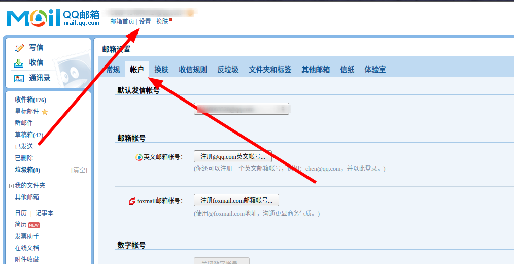
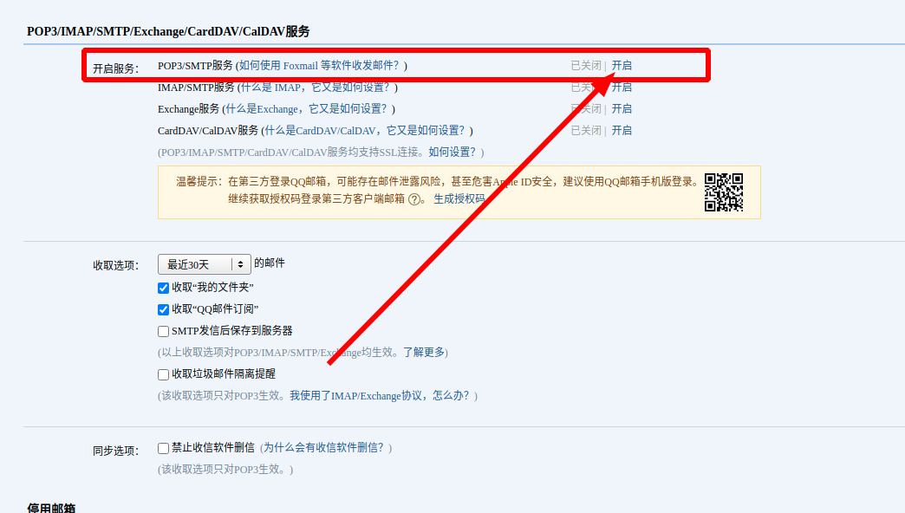
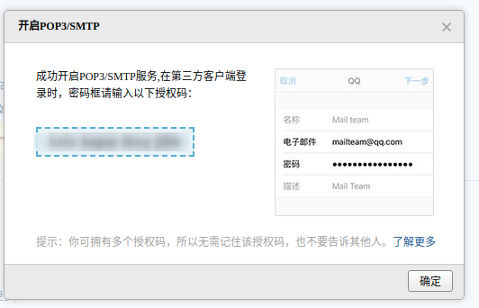

# QQ邮箱开通SMTP服务

## 开启操作

**登录QQ邮箱网页版**，之后进入**设置**——> **账户**，如下所示：

之后往下找，找到 `POP3/IMAP/SMTP/Exchange/CardDAV/CalDAV服务` 地址，开启POP3/SMTP服务，如下所示：

点击开启按钮，之后会弹出**短信密保验证**，按照要求用密保手机发送短信即可：

发送短信完成后点击 `我已发送` 按钮后就会弹出 `SMTP` 密码弹窗，**记录这个密码，后面再也看不到了**。

## 配置信息

* **SMTP Server**：`smtp.qq.com`
* **port**: `465`
* **username**: `xxxxx@qq.com`
* **password**: 上面生成的密码
