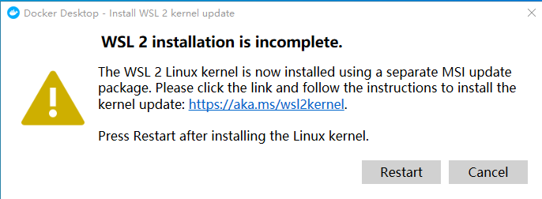
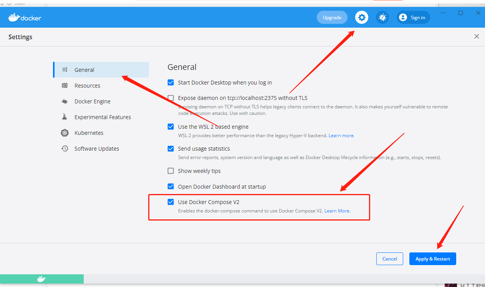
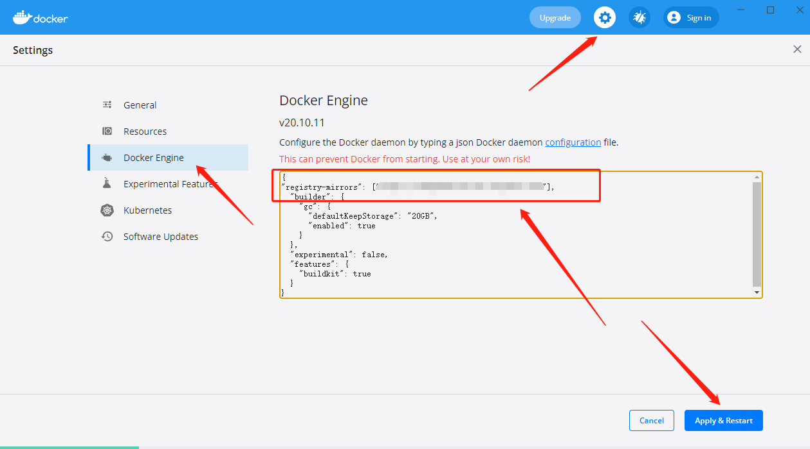
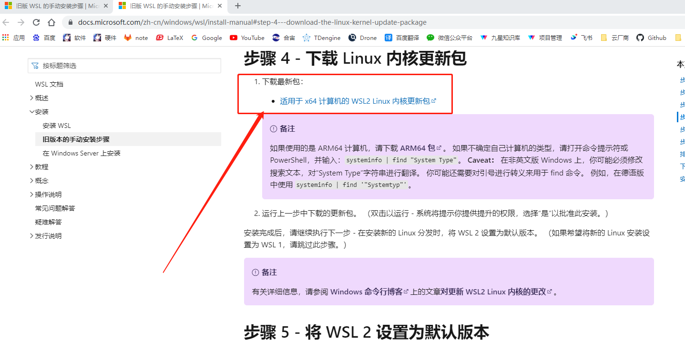

# Windows10安装

在 `Windows` 环境下可以直接安装 `Docker Desktop` 软件即可。

## 下载

从[官网](https://www.docker.com/products/docker-desktop)下载即可。**先不要着急安装**！！！

## 修改安装地址

由于 `Docker Desktop Installer` 的**默认安装地址**为 `C盘` ，**也不让选择**，因此我们需要先设置一个 `软连接` ，将 `C:\Program Files\Docker` 指到 `D盘` 下面，这样之后再安装的时候就直接安装到 `D盘` 了（需要先建立： `D:\Program Files\Docker` 文件夹）

```bash
$ mklink /j "C:\Program Files\Docker" "D:\Program Files\Docker"
Junction created for C:\Program Files\Docker <<===>> D:\Program Files\Docker
```

> [!warning]
> 此命令**必须以管理员身份运行 `CMD` 才可以**，普通用户是没有权限的。

## 安装

双击安装即可，注意勾选 `WSL2` 。安装完成后会要求**重启**。重启后可能会提示如下：



请参考附录：[Linux内核更新](#linux内核更新)

## 配置

### 启用Docker Compose

对于 `Windows` 环境， `Docker Compose` 不用像 `Linux` 那样下载二进制文件， `Docker Desktop` 已经集成了此功能，只需要在**设置**中开启即可，操作如下所示：



### 配置阿里云容器镜像加速器

在天朝开发嘛，懂得都懂。



## 附录

### Linux内核更新

点击提示框的连接，跳转到微软官方下载页面，如下所示：



点击下载连接进行下载即可。下载后的文件名叫： `wsl_update_x64.msi` ，双击安装即可。
