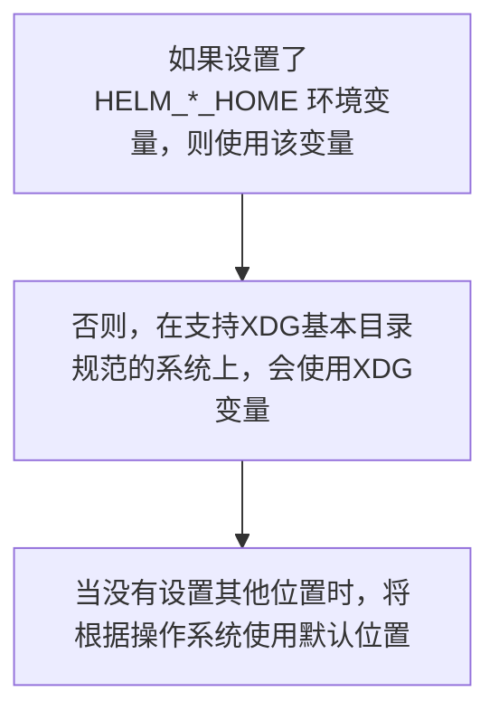

# Helm

针对 `Kubernetes` 的 `Helm` 包管理器。

## 环境变量

|名称|描述|
|-----|-----|
| `$HELM_CACHE_HOME` |设置一个存储缓存文件的可选位置|
| `$HELM_CONFIG_HOME` |设置一个存储 `Helm` 配置的可选位置|
| `$HELM_DATA_HOME` |设置一个存储 `Helm` 数据的可选位置|
| `$HELM_DEBUG` |表示 `Helm` 是否在 `Debug` 模式系运行|
| `$HELM_DRIVER` |设置后台存储驱动，值包括： `configmap` , `secret` , `memory` , `sql` |
| `$HELM_DRIVER_SQL_CONNECTION_STRING` |设置 `SQL` 存储驱动使用连接字符串|
| `$HELM_MAX_HISTORY` |设置发布历史记录的最大值|
| `$HELM_NAMESPACE` |设置用于 `helm` 操作的命名空间|
| `$HELM_NO_PLUGINS` |禁用插件， `HELM_NO_PLUGINS=1` 表示**禁用**插件|
| `$HELM_PLUGINS` |设置插件目录路径|
| `$HELM_REGISTRY_CONFIG` |设置注册配置文件的路径|
| `$HELM_REPOSITORY_CACHE` |设置仓库缓存目录路径|
| `$HELM_REPOSITORY_CONFIG` |设置仓库文件的路径|
| `$KUBECONFIG` |设置 `Kubernetes` 的可选配置文件(默认是 `~/.kube/config` )|
| `$HELM_KUBEAPISERVER` |设置用于身份认证的 `Kubernetes API` 服务端|
| `$HELM_KUBECAFILE` |设置 `Kubernetes` 证书机构文件|
| `$HELM_KUBEASGROUPS` |使用**逗号**分隔的列表设置用于模拟的组|
| `$HELM_KUBEASUSER` |为操作设置要模拟的用户名|
| `$HELM_KUBECONTEXT` |设置 `kubeconfig` 上下文的名称|
| `$HELM_KUBETOKEN` |设置用于身份验证的不记名 `KubeToken` |

## 配置顺序

`Helm` 基于以下配置顺序存储缓存，配置和添加数据：



## 默认目录

默认情况下，默认目录**取决于操作系统**，默认值如下：

|操作系统|缓存路径|配置路径|数据路径|
|-----|-----|-----|-----|
|Linux|$HOME/.cache/helm|$HOME/.config/helm|$HOME/.local/share/helm|
|macOS|$HOME/Library/Caches/helm|$HOME/Library/Preferences/helm|$HOME/Library/helm|
|Windows|%TEMP%\helm|%APPDATA%\helm|%APPDATA%\helm|

## 可选项

```bash
      --debug                       enable verbose output
  -h, --help                        help for helm
      --kube-apiserver string       the address and the port for the Kubernetes API server
      --kube-as-group stringArray   group to impersonate for the operation, this flag can be repeated to specify multiple groups.
      --kube-as-user string         username to impersonate for the operation
      --kube-ca-file string         the certificate authority file for the Kubernetes API server connection
      --kube-context string         name of the kubeconfig context to use
      --kube-token string           bearer token used for authentication
      --kubeconfig string           path to the kubeconfig file
  -n, --namespace string            namespace scope for this request
      --registry-config string      path to the registry config file (default "~/.config/helm/registry.json")
      --repository-cache string     path to the file containing cached repository indexes (default "~/.cache/helm/repository")
      --repository-config string    path to the file containing repository names and URLs (default "~/.config/helm/repositories.yaml")
```